# ESP32-C3 Lux Sensor

This compact lux sensor uses a BH1750 ambient-light sensor and an ESP32-C3 development board. An adjustable DROK step-down converter allows the assembly to run from an 18 V DC supply.

## Parts

| Component | Quantity | Notes | Purchase link |
| --- | ---: | --- | --- |
| ESP32-C3 development board | 1 | Powered with 5 V through `VUSB` | [Amazon](https://a.co/d/08KFqkEg) |
| BH1750 ambient-light sensor module | 1 | Powered from the ESP32-C3's 3.3 V output | [Amazon](https://a.co/d/03Q0Uxf5) |
| DROK adjustable DC step-down converter | 1 | Converts the 18 V input to 5 V | [Amazon](https://a.co/d/06YKp1IT) |
| Hookup wire | As needed | Suitable for short power and I2C connections | |
| Solder | As needed | | |

## Tools and Supplies

- Soldering iron
- Multimeter
- Wire cutters and strippers
- Insulating mounting material or adhesive

## Power

The DROK converter receives 18 V DC and reduces it to 5 V for the ESP32-C3. Its 5 V output connects to the ESP32-C3 `VUSB` and `GND` pins.

Set and verify the converter output with a multimeter before connecting it to the ESP32-C3. Never connect the 18 V supply directly to the ESP32-C3 or BH1750.

## Wiring

### Power Converter

| From | To | Notes |
| --- | --- | --- |
| 18 V supply positive | DROK input positive | Observe input polarity |
| 18 V supply ground | DROK input ground | |
| DROK 5 V output positive | ESP32-C3 `VUSB` | Verify 5.0 V before connecting |
| DROK output ground | ESP32-C3 `GND` | All grounds are common |

### BH1750

| BH1750 pin | ESP32-C3 pin | Purpose |
| --- | --- | --- |
| `VCC` | `3.3V` | Sensor power |
| `GND` | `GND` | Ground |
| `SCL` | `D5` / GPIO 7 | I2C clock |
| `SDA` | `D4` / GPIO 6 | I2C data |

These assignments are verified against Seeed Studio's XIAO ESP32C3 pin map. `D8` is GPIO 8/SPI SCK and `D9` is GPIO 9/SPI MISO; they are not the board's labeled I2C pins.

## Assembly

1. With power disconnected, adjust the DROK converter for a 5.0 V output using the 18 V supply and a multimeter. Disconnect power again after adjustment.
2. Mount the BH1750 on top of the ESP32-C3 as shown below. Keep the light-sensing component exposed and unobstructed.
3. Mount the DROK converter underneath the ESP32-C3 as shown below.
4. Add insulating material where needed so the stacked circuit boards and solder joints cannot short against one another.
5. Cut and route the hookup wires between the boards.
6. Solder all power and signal connections listed in the wiring tables.
7. Inspect the assembly for solder bridges, loose wire strands, reversed polarity, and mechanical strain.

## ESPHome Configuration

The sanitized configuration copied from Home Assistant is stored in [`esphome/lux-sensor.yaml`](esphome/lux-sensor.yaml). The deployed `lux-sensor-1` through `lux-sensor-4` files use the same sensor configuration and differ only in their device names and credentials.

To configure another sensor:

1. Copy `esphome/lux-sensor.yaml` into the private ESPHome configuration directory.
2. Change the `display_name` substitution to a unique device name such as `lux-sensor-5`.
3. Add the values shown in [`esphome/secrets.example.yaml`](esphome/secrets.example.yaml) to the private ESPHome `secrets.yaml` file.
4. Generate unique API encryption and OTA credentials rather than committing real values to this public repository.
5. If using a different board model or revision, validate its pin assignments before flashing.

The live ESPHome configuration correctly addresses the I2C bus as GPIO 6 for SDA and GPIO 7 for SCL, corresponding to the XIAO ESP32C3's `D4` and `D5` labels.

## Schematics and Manufacturer Documentation

The [`schematics`](schematics/) directory contains Seeed Studio's official XIAO ESP32C3 v1.3 schematic, editable KiCad design files, and front/back pinout diagrams. Seeed's current source documents are also available directly:

- [XIAO ESP32C3 v1.3 schematic](https://files.seeedstudio.com/wiki/XIAO_WiFi/Resources/XIAO_ESP32C3_v1.3_SCH_260116.pdf)
- [XIAO ESP32C3 v1.3 KiCad project](https://files.seeedstudio.com/wiki/XIAO_WiFi/Resources/XIAO_ESP32C3_v1.3_KiCad_260116.zip)
- [XIAO ESP32C3 pin map](https://wiki.seeedstudio.com/XIAO_ESP32C3_Getting_Started/#pin-map)

No official board-level schematic is published for the other two modules:

- HiLetgo has not published a schematic or PCB design for its GY-30/GY-302 BH1750 module. Generic diagrams found elsewhere are third-party designs and may not match this board.
- DROK publishes the [200548_5x converter specifications](https://www.droking.com/5pcs-mini-voltage-buck-regulator-board-dc-4-5-20v-12v-9v-step-down-to-5v-reducer-transformer-board-3a-10w-adjustable-fixed-volt-output-step-down-power-supply-stabilizer-module), but no board schematic, controller part number, or PCB design.

The BH1750FVI sensor IC datasheet is not a schematic for the HiLetgo module. ROHM has removed its original hosted copy, so no third-party datasheet copy is stored here as if it were current manufacturer documentation.

## Photos

### BH1750 Top Mount

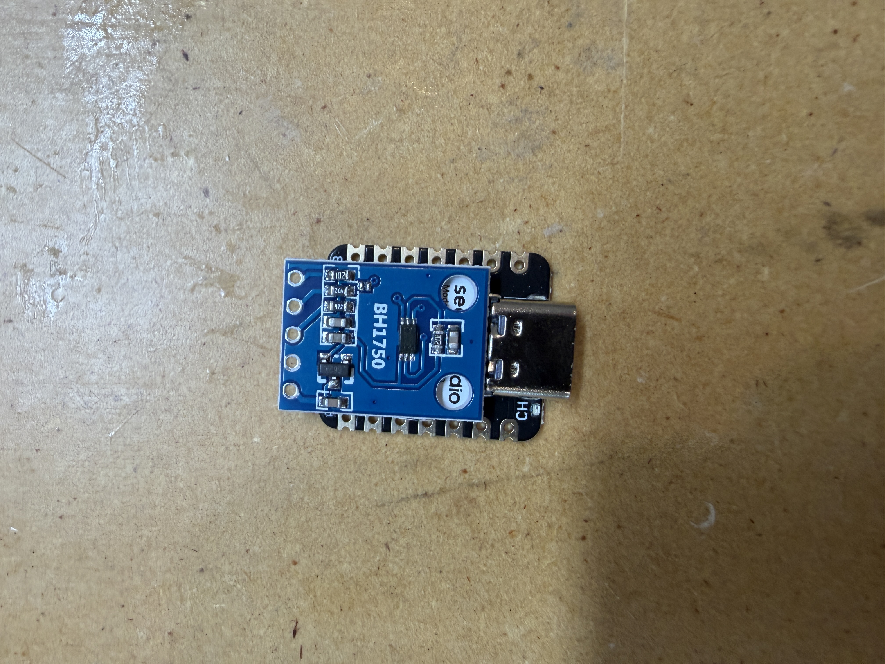

### DROK Converter Bottom Mount

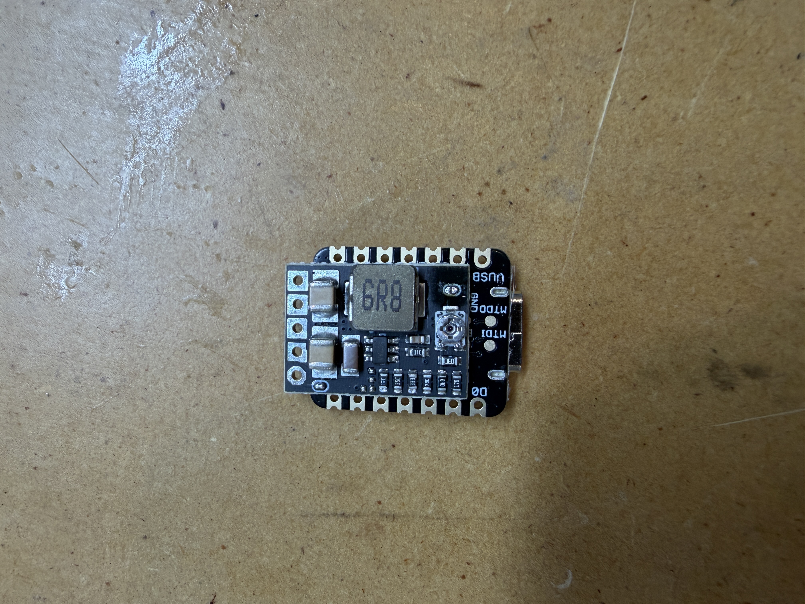

### Completed Assembly

The completed assembly includes the stacked boards, soldered power and I2C wiring, power lead, and ESP32-C3 antenna.

| | |
| --- | --- |
| 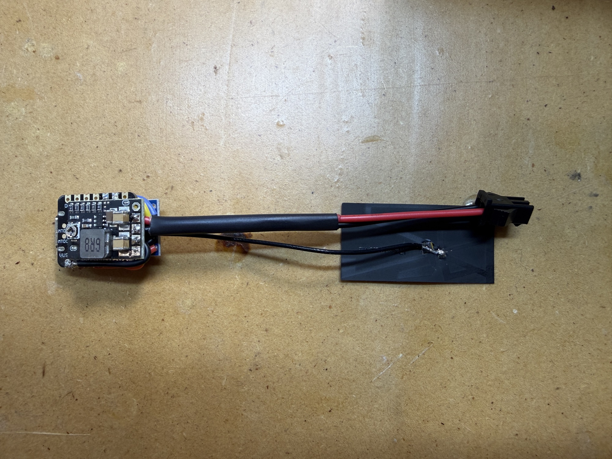 Completed assembly | 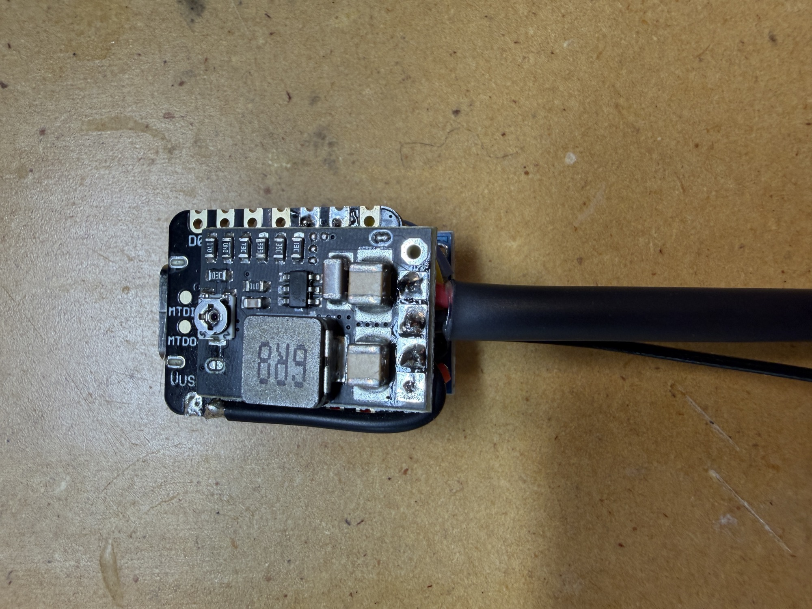 Converter wiring close-up |
| 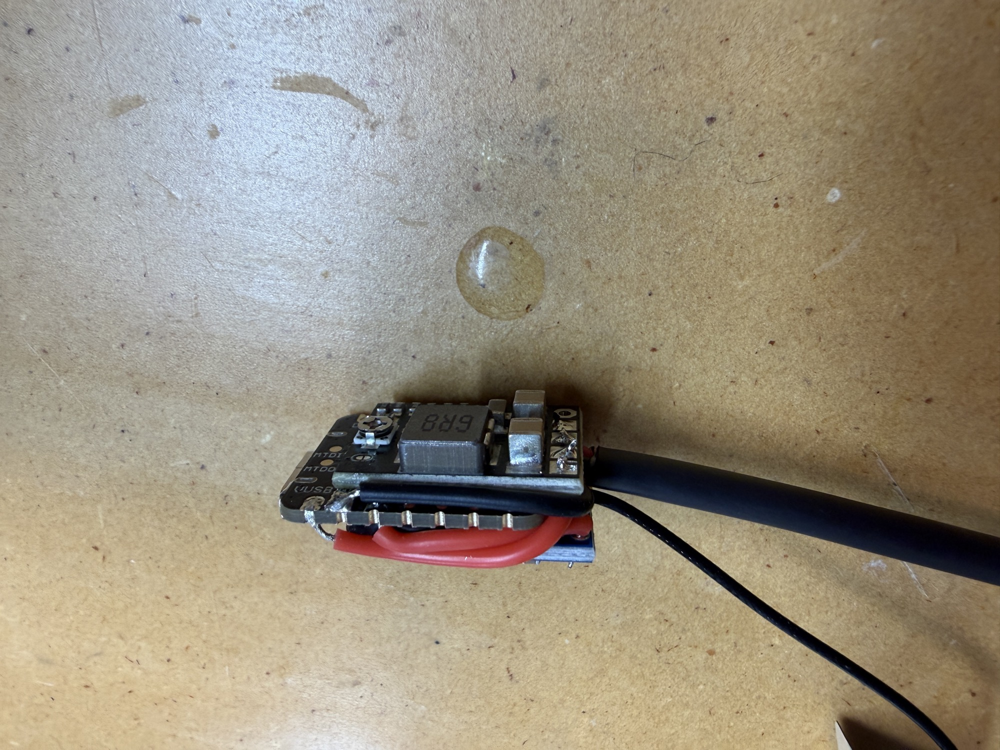 Converter-side power wiring | 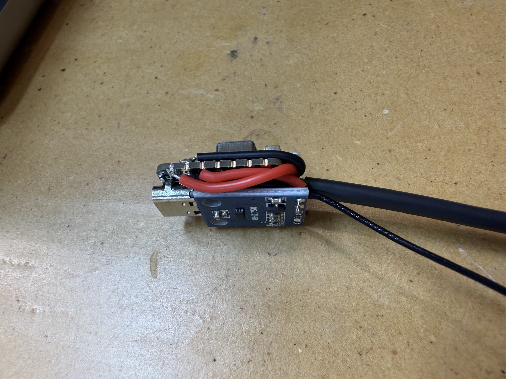 Board stack side profile |
| 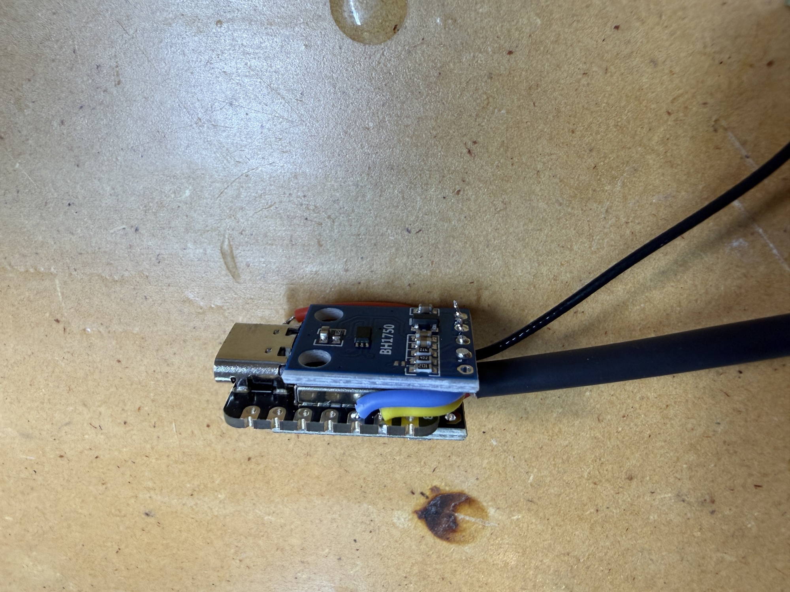 BH1750 wiring close-up | 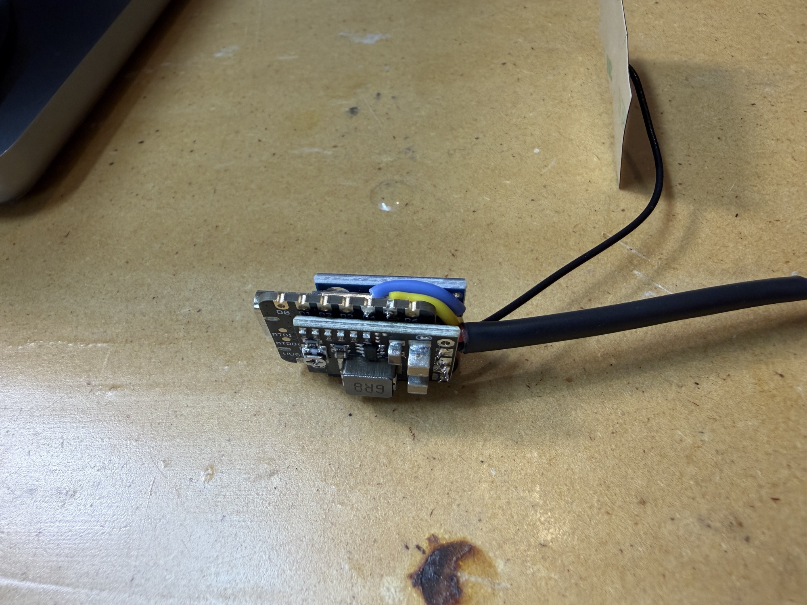 I2C wiring side view |
| 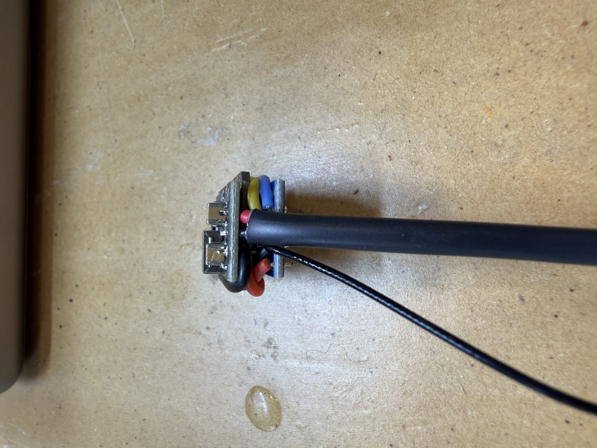 USB-end side view | 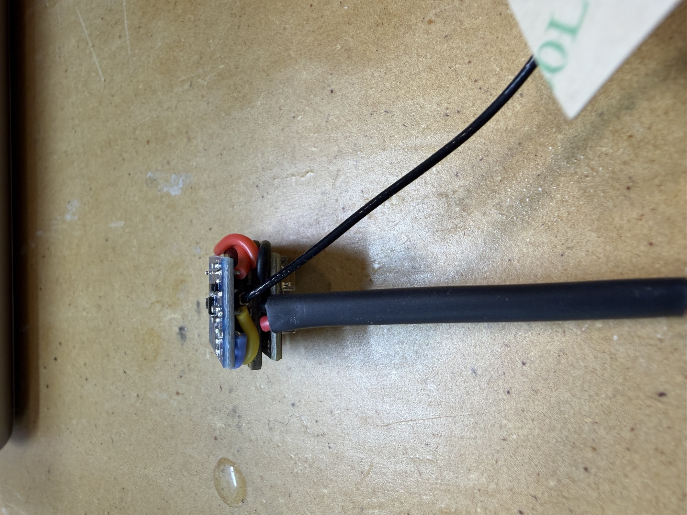 Power cable entry |
| 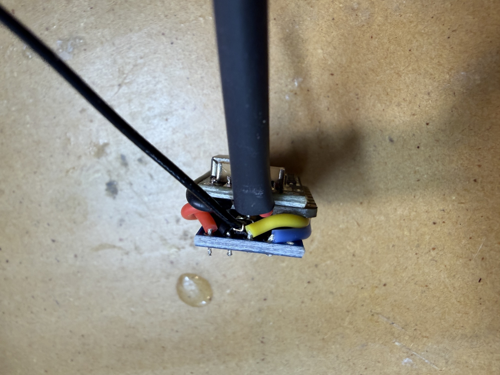 Cable-entry wiring | 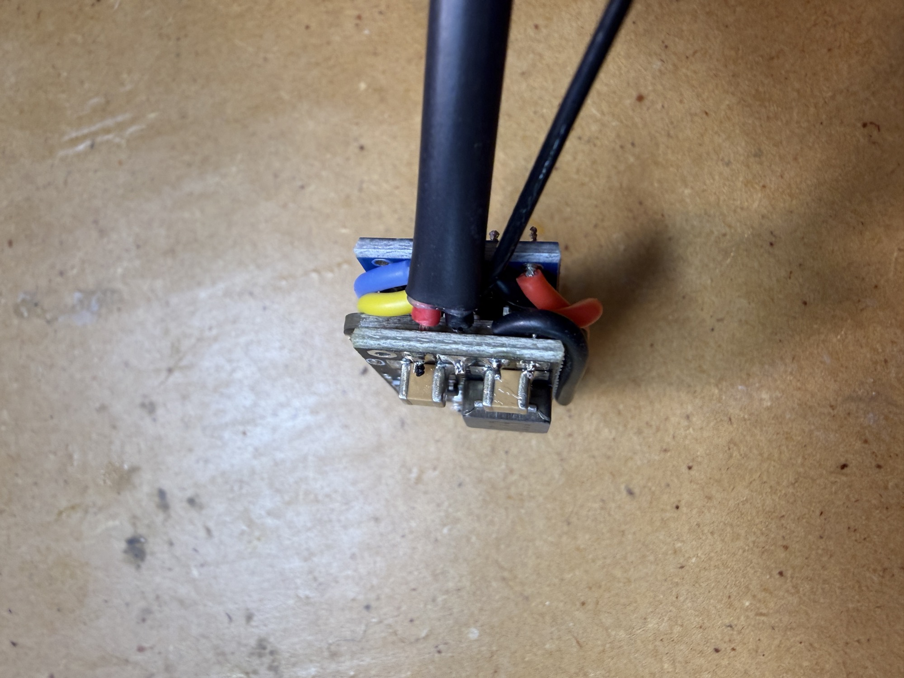 USB-end wiring |

## Final Checks

Before applying power:

- Verify the 18 V input polarity.
- Confirm that the DROK output is 5.0 V.
- Confirm that 5 V connects to `VUSB`, not the `3.3V` pin.
- Confirm that the BH1750 receives 3.3 V.
- Check continuity between all ground connections.
- Confirm that power and ground are not shorted.
- Ensure the BH1750 sensing component is not covered by adhesive, wiring, or an enclosure.

After completing these checks, apply 18 V and verify that the ESP32-C3 starts normally and reports BH1750 lux readings.

## Safety Notes

- Disconnect power before soldering or changing wiring.
- Verify converter output voltage before attaching sensitive electronics.
- Insulate the exposed assembly before permanent installation.
- Add suitable input protection and strain relief when installing the sensor in its final location.

## Revisions

| Date | Change |
| --- | --- |
| 2026-07-18 | Corrected I2C wiring and added official schematic resources |
| 2026-07-18 | Added the sanitized ESPHome configuration from Home Assistant |
| 2026-07-18 | Added completed assembly photos and the BH1750 purchase link |
| 2026-07-18 | Initial build documentation |
