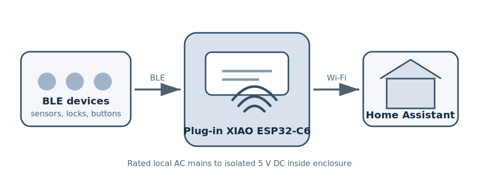
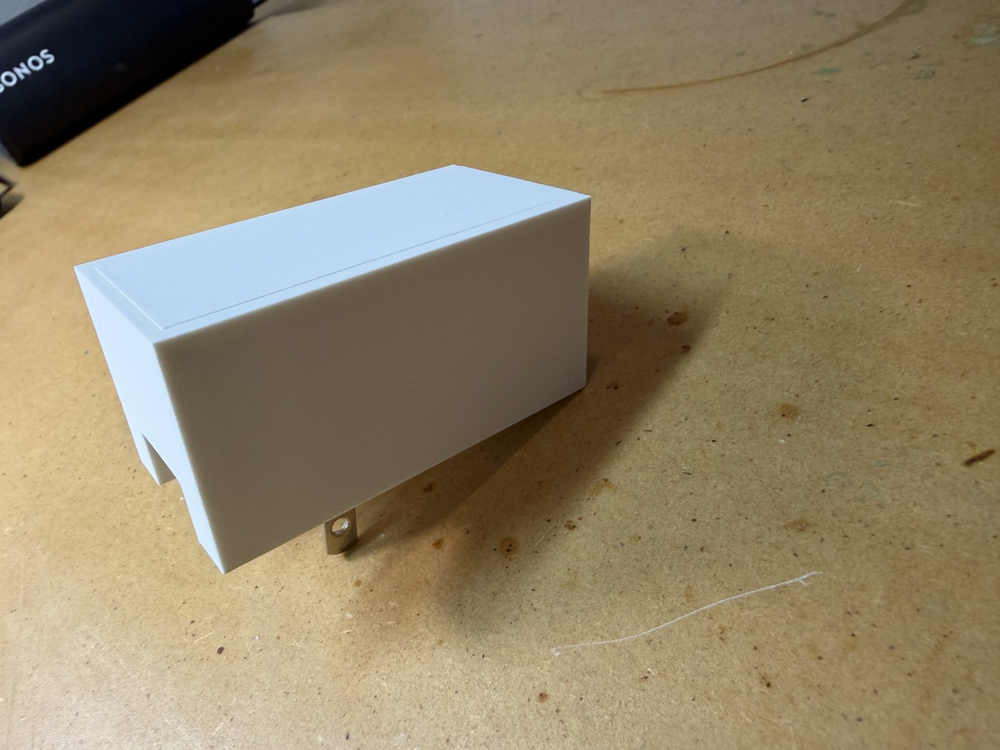
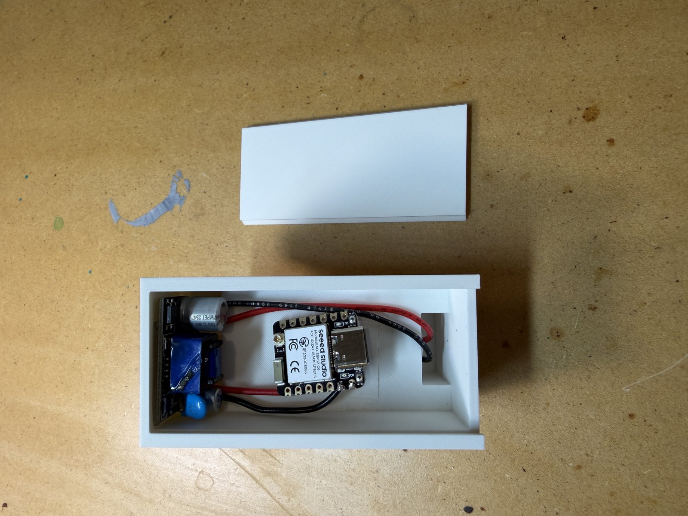
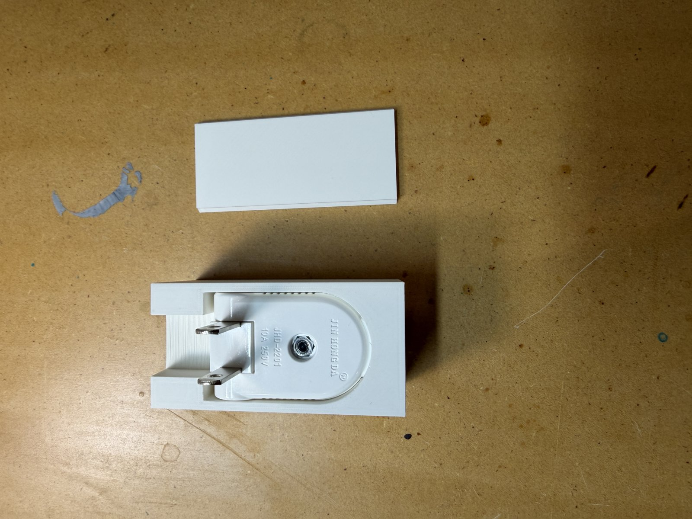
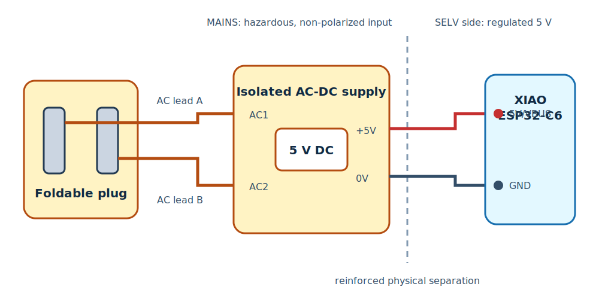
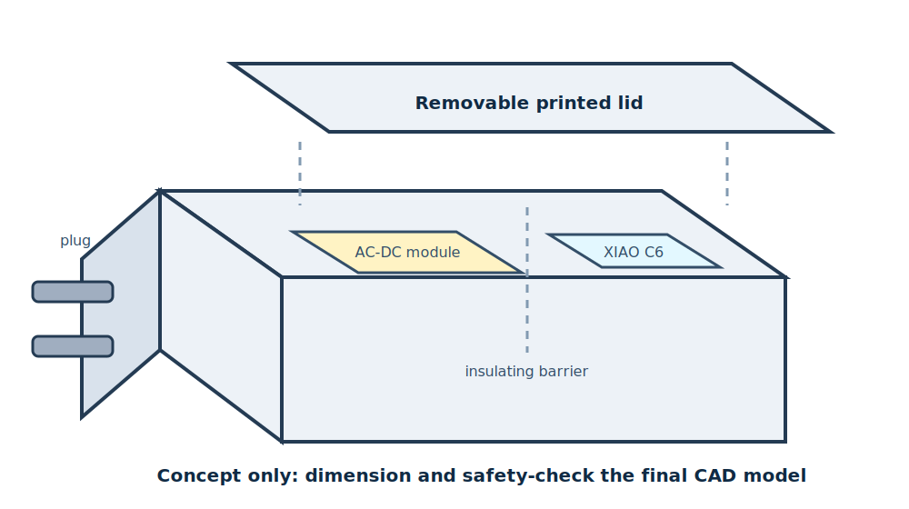

# ESP32-C6 Plug-In Bluetooth Proxy

This compact, mains-powered ESPHome Bluetooth proxy extends Home Assistant's Bluetooth coverage. A Seeed Studio XIAO ESP32-C6 and an isolated 5 V AC-DC module fit inside a custom 3D-printed housing attached to a foldable two-prong plug.

> [!CAUTION]
> This project places utility mains voltage inside a 3D-printed enclosure. Mains voltage can cause fatal electric shock or fire. Use only a suitably rated, isolated, enclosed AC-DC supply; provide insulation, strain relief, overcurrent protection, flame-resistant materials, and required creepage/clearance. Have the completed assembly reviewed by a qualified electrician before plugging it in. A listed USB wall adapter is the safer alternative.

## Finished Build

The completed unit: the lid closes flush and only the folding plug prongs are exposed.

Inside the shell, the isolated AC-DC module occupies the mains end and the XIAO ESP32-C6 sits at the low-voltage end with the antenna area kept clear.

The folding Type A plug is recessed into the printed base. The delivered part is molded `JIN HONG DA JHD-2201 10A 250V`, which resolves the conflicting ratings in the product listing; treat 10 A / 250 V as the confirmed rating.

## Parts

| Component | Quantity | Notes | Purchase link |
| --- | ---: | --- | --- |
| Seeed Studio XIAO ESP32-C6 | 1 | 21 x 17.8 mm; Wi-Fi 6 and BLE 5.0; onboard and U.FL antenna options | [Amazon](https://a.co/d/0iScRAVY) |
| Isolated AC-DC switching power module | 1 | Regulated 5 V output; verify the actual module's marked input range, output current, isolation, and approvals | [China Global Mall](https://www.chinaglobalmall.com/products/PQZOR0TnkBJozekHg) |
| Surf turtle rotatable two-prong replacement plug | 1 | Foldable/90-degree Type A plug; verify ratings from markings because the product listing is inconsistent | [Amazon](https://www.amazon.com/dp/B0F1KHGL5L) |
| Custom 3D-printed housing and lid | 1 | Model around the exact boards, insulation barriers, fasteners, and clearances in the final build | Custom model |
| Insulated hookup wire | As needed | Use wire with voltage, temperature, and current ratings suitable for each side of the supply | |
| Heat-shrink tubing and insulating barriers | As needed | Must be rated for the voltages and temperatures involved | |
| Fuse or approved fusible input element | 1 | Size for the supply and applicable electrical code | |

The linked plug listing conflicts with itself: its title says 125 V/10 A, while other listing fields claim 250 V/10 A or 15 A. Do not rely on the listing. Verify the molded or printed markings on the delivered part and use it only within the lowest confirmed rating.

## Electrical Architecture

The plug feeds the isolated AC input of the switching module. The module's regulated 5 V output powers the XIAO through `5V/VBUS` and `GND`. There are no Bluetooth-related GPIO connections.

| From | To | Notes |
| --- | --- | --- |
| Plug blade lead A | AC-DC module AC input 1 | A non-polarized Type A plug does not guarantee that this conductor is neutral |
| Plug blade lead B | AC-DC module AC input 2 | Treat both input conductors as hazardous while connected |
| AC-DC module `+5V` | XIAO `5V/VBUS` | Verify a stable 5.0 V output before connecting the XIAO |
| AC-DC module `0V`/`GND` | XIAO `GND` | Keep the low-voltage side physically separated from mains wiring |

Do not connect external 5 V and USB-C at the same time unless the final circuit includes verified backfeed protection. Disconnect the mains input before connecting USB for the initial flash.

## Enclosure

The housing consists of a main shell and a sliding/removable lid. Arrange the plug and AC-DC module at the mains end, retain the XIAO at the low-voltage end, and maintain a rigid insulating barrier between those zones.

The diagram is an assembly reference, not a dimensioned fabrication model. Before printing the final housing:

1. Measure the exact plug, power module, XIAO, wire bends, solder joints, and insulation used in the build.
2. Add positive mechanical retention so pulling, folding, or rotating the plug cannot stress solder joints.
3. Prevent any mains conductor or exposed joint from entering the low-voltage compartment, including after a wire comes loose.
4. Keep plastic and wiring clear of heat-producing components and preserve the radio antenna keep-out area.
5. Use flame-retardant material appropriate for an unattended mains enclosure; ordinary PLA is not a safety-rated electrical enclosure material.

## ESPHome Configuration

The current build uses an ESP32-C6, but earlier units used an ESP32-C3. Two complete, sanitized profiles are included so changing boards does not require remembering every chip-specific setting:

| Hardware | Configuration | Intended use |
| --- | --- | --- |
| Seeed Studio XIAO ESP32-C6 | [`esphome/ble-proxy.yaml`](esphome/ble-proxy.yaml) | Current build and default profile |
| Legacy ESP32-C3 | [`esphome/ble-proxy-c3.yaml`](esphome/ble-proxy-c3.yaml) | Replacement or reflash of the original C3-based units |

Both profiles were derived from the three live HA ESPHome Builder files (`ble-proxy-1.yaml`, `ble-proxy-2.yaml`, and `ble-proxy-3.yaml`) on 2026-07-20. Copy [`esphome/secrets.example.yaml`](esphome/secrets.example.yaml) to the ESPHome secrets file and replace every placeholder locally.

The live files all share these runtime settings:

| Setting | Live value retained here |
| --- | --- |
| Framework | ESP-IDF |
| BLE scan interval/window | 300 ms / 300 ms |
| Active scanning | Enabled |
| Active Bluetooth proxy | Enabled |
| Connection slots | 5 |

ESPHome 2026.7.0 also requires `esp32_ble.max_connections: 5` when five proxy connection slots are requested, so the sanitized configuration includes that matching stack limit.

### C3 and C6 Board Settings

These are the hardware-specific values. Do not combine the C3 board/variant values with C6 hardware or vice versa.

| Setting | Current XIAO ESP32-C6 | Legacy ESP32-C3 |
| --- | --- | --- |
| Recommended `substitutions.name` | `ble-proxy-c6` | `ble-proxy-c3` |
| Recommended `substitutions.friendly_name` | `Bluetooth Proxy C6` | `Bluetooth Proxy C3` |
| `esp32.board` | `seeed_xiao_esp32c6` | `esp32-c3-devkitm-1` |
| `esp32.variant` | `ESP32C6` | `ESP32C3` |
| `esphome.platformio_options.board_build.mcu` | Not set | `esp32c3` |
| `esphome.platformio_options.board_build.variant` | Not set | `esp32c3` |
| `esphome.platformio_options.board_build.flash_mode` | Not set | `dio` |
| `esp32.framework.sdkconfig_options` | Not set | BLE 5.0, BLE 4.2, and 10-second task-watchdog options retained from HA |
| Framework | `esp-idf` | `esp-idf` |

The C3 profile intentionally preserves the generic `esp32-c3-devkitm-1` board declaration and PlatformIO overrides used by the known-working live files. The C6 profile uses ESPHome's dedicated `seeed_xiao_esp32c6` board definition, available in ESPHome 2025.12.0 and later.

The `esp32.board`, `esp32.variant`, PlatformIO block, and C3 SDK options are the values that change the compiled hardware target. The node and friendly names identify the device but do not select its chip.

The `dio` flash-mode override belongs only to the legacy C3 profile; it was added there to prevent serial-flash boot loops. The dedicated C6 board definition supplies its own correct build settings and must not inherit the C3 PlatformIO or SDK-options blocks.

These settings stay the same for both boards:

- ESP-IDF framework
- Logger, encrypted Home Assistant API, OTA, Wi-Fi, and fallback hotspot
- `esp32_ble.max_connections: 5`
- 300 ms active BLE scan interval and window
- Active Bluetooth proxy with five connection slots

No application GPIO values need changing because this project connects only `5V/VBUS` and `GND`; Bluetooth and Wi-Fi use each chip's internal radio.

### Switching Between Boards

1. Disconnect the proxy from mains and remove it from the enclosure before handling or connecting USB.
2. Select `ble-proxy.yaml` for the XIAO ESP32-C6 or `ble-proxy-c3.yaml` for the original C3 hardware.
3. If this board replaces an existing proxy, set `substitutions.name` and `substitutions.friendly_name` to the identity you want it to use. Preserve the old node name only when the new board is replacing that node; use a unique name if both boards will remain online.
4. Supply the common Wi-Fi, API, OTA, and fallback-hotspot values through `secrets.yaml`. If both boards will operate independently and should have separate API or OTA credentials, give each YAML profile distinct secret names and values rather than sharing the example references.
5. Validate the selected profile in ESPHome Builder.
6. Connect the unpowered board directly by USB-C and perform the first install over USB. Do not OTA-flash C3 firmware onto a C6 or C6 firmware onto a C3.
7. Disconnect USB and test the board from a current-limited 5 V bench supply before reconnecting the AC-DC module.
8. Confirm the correct node appears online in ESPHome Builder and Home Assistant, then verify passive discovery and an active Bluetooth connection.
9. Recheck physical fit, insulation, antenna clearance, and the `5V/VBUS` and `GND` connections before closing the enclosure.

If ESPHome Builder still contains an old C3 node and the physical board has been replaced by a C6, update that node with the C6 board block shown above and perform a USB install. Changing only the display name does not change the compiled chip target.

The live secret values were intentionally omitted. The three source files currently reuse the same API encryption key, OTA password, and fallback hotspot password; this repository uses `!secret` references instead.

### Flashing

1. Leave the mains input disconnected and keep the assembly outside the enclosure.
2. Connect the XIAO to the ESPHome Builder computer by USB-C.
3. Add `ble-proxy.yaml` to ESPHome Builder and supply the referenced secrets.
4. Validate and install the configuration over USB.
5. Disconnect USB, energize the isolated 5 V side using a current-limited bench supply, and verify boot, Wi-Fi, Home Assistant API, and Bluetooth proxy operation.
6. Only after low-voltage testing passes, disconnect all power and complete the mains-side assembly and enclosure.

## Assembly

1. Print the housing and lid using the final measured model and a suitable flame-retardant material.
2. With all power disconnected, install and mechanically retain the foldable plug.
3. Add the input fuse/protection and connect the two plug leads to the AC input of the isolated supply.
4. Fully insulate each mains connection and install the mains-to-low-voltage barrier.
5. Before connecting the XIAO, power the supply through an isolation-aware, current-limited test setup and verify output voltage, polarity, ripple, and temperature. Disconnect power afterward.
6. Connect the module's regulated `+5V` and `0V` outputs to the XIAO `5V/VBUS` and `GND` pins.
7. Mount the XIAO with its antenna away from the AC-DC module, mains wiring, and metal hardware.
8. Inspect retention, insulation, clearances, wire routing, and lid fit before closing the enclosure.

## Testing

Before applying mains power:

- Confirm there is no continuity between either mains conductor and the 5 V side.
- Confirm there is no short across the plug blades or across the 5 V output.
- Verify `+5V` polarity at the XIAO and verify the module output before attaching the board.
- Tug-test all wiring and confirm that no loose conductor can cross the isolation barrier.
- Confirm all live joints are inaccessible with the enclosure closed and the lid cannot open while plugged in.
- Confirm the plug, fuse, wiring, power module, and enclosure are all suitable for the local supply voltage.

After qualified mains-safety review:

1. Power the unit through an appropriately protected test outlet.
2. Check for abnormal sound, odor, heat, or unstable output and disconnect immediately if any appears.
3. Confirm the ESPHome device comes online in Home Assistant.
4. Verify the device reports the expected ESPHome firmware and remains connected.
5. Confirm a nearby Bluetooth device is discovered through the proxy and, if applicable, completes an active GATT connection.
6. Run a thermal soak in a controlled, attended setup before permanent use.

## References

- [ESPHome Bluetooth Proxy documentation](https://esphome.io/components/bluetooth_proxy/)
- [ESPHome ESP32 platform documentation](https://esphome.io/components/esp32/)
- [Seeed Studio XIAO ESP32-C6 getting-started guide](https://wiki.seeedstudio.com/xiao_esp32c6_getting_started/)

## Revisions

| Date | Change |
| --- | --- |
| 2026-07-20 | Added finished-build photos and confirmed plug markings |
| 2026-07-20 | Added C3/C6 profiles and board-swap instructions |
| 2026-07-20 | Initial build documentation, sanitized ESPHome configuration, and diagrams |
