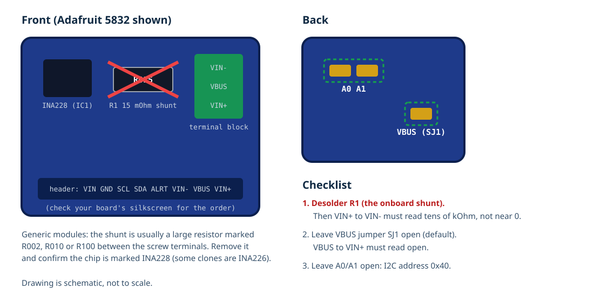

# Renogy Battery Monitor to Home Assistant (XIAO ESP32-S3 + INA228)

A Seeed Studio XIAO ESP32-S3 and a TI INA228 current/voltage monitor, built into the display housing of the Renogy 500 A Battery Monitor with Shunt (RBM500) in the Casita travel trailer. The INA228 measures the existing 500 A shunt and the battery voltage. The ESP32 counts amp-hours to track state of charge, then publishes voltage, current, power, state of charge, remaining amp-hours, time to empty or full, and daily charged/discharged energy to Home Assistant. It also serves a local web page so a phone on the trailer's Wi-Fi can check the battery without Home Assistant.

The Renogy display keeps working exactly as before. The INA228 reads the same shunt in parallel through the display cable's sense wires, so you end up with two independent monitors.


> [!IMPORTANT]
> **Status: design documented, not yet built.** The ESPHome configuration validates and compiles with ESPHome 2026.9.1. The XIAO, buck regulator and power wiring are already installed and working in the display housing (from the earlier serial-tap attempt); the INA228 has not been wired or run yet. Step 2 checks that the display cable's sense wires carry the raw shunt voltage before anything is connected to them.

## How It Works

1. The 500 A shunt sits in the battery negative. The display's shielded cable carries battery positive and negative (`B+`, `B-`) and the shunt's sense pair (`Rs+`, `Rs-`) to the display board.
2. A 12 V to 5 V buck regulator, fed from the backs of the display connector's `B+` and `B-` pins, powers the XIAO. The XIAO's 3.3 V pin powers the INA228.
3. The INA228's differential inputs (`VIN+`, `VIN-`) connect to the `Rs+`/`Rs-` pins through 10 ohm resistors, with a 0.1 uF capacitor across them. It measures the millivolts across the shunt with 20-bit resolution and its own hardware charge accumulator.
4. The INA228's `VBUS` pin connects to `B+` and measures battery voltage against its ground (`B-`).
5. Every second, ESPHome reads the INA228 over I2C. The change in the INA228's charge accumulator is added to a stored "remaining amp-hours" value, which becomes the state of charge.
6. When the bank reaches full charge (high voltage with tapering charge current), state of charge resets to 100%, which cancels any accumulated drift.

Everything inside the housing shares one ground: the display's `B-`, which is the battery side of the shunt. The XIAO has no other wired connection, so nothing creates a second current path around the shunt.

## Why Not the Display's Serial Port

The first version of this project tried to read the display's own serial output. It does not work on this unit, and the files are kept in [`esphome/archive/`](esphome/archive/) for reference.

The display board is a Baiway TF03H V35. Baiway's TF03 meters can output a 9600-baud serial frame, but only on "customized" models fitted with an isolator module at `MK1`; this one is not. Tests run on 2026-10-09 with diagnostic firmware that logged every UART byte and counted every signal edge:

| Pad tested (with display awake) | Result |
| --- | --- |
| `Tx` (6-hole row) | Idle at 3.0 V, zero edges for 20+ minutes |
| `Tx` with a 10 kohm pull-up from `TEN` to `V+` | Zero edges |
| `Rx`, `TEN`, `MK2 T`, `MK2 R` | Zero edges |

Baiway's documentation describes serial output as a customized model option, the display menu has no communication setting, and no one online has reported enabling it on a standard unit. The conclusion is that serial output is disabled in this display's firmware. Measuring the shunt directly with an INA228 avoids the problem entirely.

## Known Limitations

- **The XIAO's own power is not metered.** It is taken from the battery side of the shunt, so neither the INA228 nor the Renogy display sees it (roughly 0.5 W, about 1 Ah per day, plus the display's own 10-15 mA). State of charge slowly reads high by that amount until the next full-charge resync.
- **Coulomb counting drifts.** Calibration errors accumulate over days. The full-charge resync corrects it, so the bank needs to reach full occasionally: at or above `full_voltage` (default 14.0 V) with the charge current tapered to `full_tail_current` (default 6 A) for 2 minutes. If your charger never exceeds about 13.8 V, the resync will not trigger; use the **Mark Battery Full** button after a known full charge.
- **It is always on.** `B+` comes straight from the battery, so the XIAO runs even when the trailer's battery disconnect switch is off: about 1 Ah per day in storage.
- **State of charge is saved to flash every 10 minutes.** After an unexpected power loss, up to 10 minutes of counting can be lost.
- **Remote reading away from home needs a network path.** See [Reading the battery away from home](#reading-the-battery-away-from-home).

## Parts

| Component | Quantity | Notes | Purchase link |
| --- | ---: | --- | --- |
| Seeed Studio XIAO ESP32-S3 | 1 | Already installed. Uses an external U.FL antenna | [Seeed](https://www.seeedstudio.com/XIAO-ESP32S3-p-5627.html) |
| 12 V to 5 V buck regulator and C1 (470 uF, 25 V) | 1 each | Already installed. Example: Pololu D24V5F5 | [Pololu](https://www.pololu.com/product/2843) |
| INA228 breakout | 1 | Already owned. Adafruit 5832 or a module with a genuine INA228 chip. **The onboard shunt must be removed** | [Adafruit](https://www.adafruit.com/product/5832) |
| 10 ohm resistors | 2 | 1/4 W or 0805; input filter and protection | |
| C2: 0.1 uF ceramic capacitor | 1 | X7R or C0G, 25 V or higher; across `VIN+`/`VIN-` | |
| Thin stranded hookup wire | About 0.5 m | 26-28 AWG silicone; use a twisted pair for `Rs+`/`Rs-` | |
| Inline fuse holder and 1 A fuse | 1 | On the RBM500's `B+` wire, close to the battery, if not already fused | |
| Kapton tape, heat-shrink, hot glue | As needed | Insulation and mounting inside the housing | |

Check that the INA228 breakout fits inside the housing next to the XIAO and regulator (the Adafruit board is about 25 x 23 mm). If it does not, mount everything in a small enclosure directly behind the display and run the same wires to it.

## Tools and Supplies

- Fine-tip soldering iron, solder, flux and solder wick; hot air helps to remove the breakout's onboard shunt
- Multimeter with DC millivolts, resistance and continuity
- DC clamp meter (optional, for the most accurate calibration)

## Prepare the INA228 Breakout



INA228 breakouts are built to measure current through their own small shunt. **That shunt must come off.** If it stays, it sits directly across the display cable's `Rs+`/`Rs-` sense wires, forming a parallel path to the 500 A shunt: the sense wires would carry part of the trailer's load current, both monitors would read wrong, and the thin wires could overheat.

1. **Remove the onboard shunt.** On the Adafruit 5832 it is R1, a large 2512 resistor marked `R015` (15 mohm) between the INA228 chip and the 3-pin terminal block. On generic modules it is usually marked `R002`, `R010` or `R100`. Desolder it with hot air or two irons.
2. **Check:** resistance from `VIN+` to `VIN-` must now read tens of kilohms (the chip's input), not near zero.
3. **VBUS jumper:** on the Adafruit board, leave SJ1 (on the back, near `VBUS`) open, which is the default. Check that `VBUS` to `VIN+` reads open.
4. **Address:** leave A0 and A1 open for I2C address 0x40.
5. **Chip check:** confirm the chip is marked INA228. Some low-cost "INA228" modules carry an INA226, which this configuration does not support.

## Where to Connect on the Display Board


All four connections are made to the backs of the white shunt connector's pins on the display board:

| Pin | Goes to |
| --- | --- |
| `B+` | Buck regulator `VIN` (already connected) and INA228 `VBUS` |
| `B-` | Buck regulator `GND` (already connected). This is the ground for everything |
| `Rs+` | 10 ohm resistor, then INA228 `VIN+` |
| `Rs-` | 10 ohm resistor, then INA228 `VIN-` |

Which way round `Rs+`/`Rs-` go only sets the sign of the reading; `current_sign` in the YAML corrects it. Do not use anything in the six-hole row, `MK1`, `MK2` or `PROG`.

## Wiring


| From | To | Notes |
| --- | --- | --- |
| Display `B+` pin (back) | Buck `VIN`, C1 `+`, INA228 `VBUS` | Buck and C1 already installed |
| Display `B-` pin (back) | Buck `GND`, C1 `-` | Already installed |
| Buck `VOUT` (5 V) | XIAO `5V` | Already installed |
| Buck `GND` | XIAO `GND`, INA228 `GND` | |
| XIAO `3V3` | INA228 `VIN` / `VS` (the breakout's power pin) | Not to be confused with `VIN+`/`VIN-` |
| XIAO `D4` (GPIO5) | INA228 `SDA` | The Adafruit board has 10 kohm pull-ups |
| XIAO `D5` (GPIO6) | INA228 `SCL` | |
| Display `Rs+` | 10 ohm, then INA228 `VIN+` | Twist with the `Rs-` wire |
| Display `Rs-` | 10 ohm, then INA228 `VIN-` | |
| C2, 0.1 uF | Across INA228 `VIN+` and `VIN-` | At the breakout, after the 10 ohm resistors |

### XIAO ESP32-S3 pins


> [!WARNING]
> Never plug USB into the XIAO while the shunt cable is connected to the display. Use wireless updates once the XIAO is installed.

## Build

### Step 1: Remove the serial-tap test wiring

Unplug the shunt cable from the display, then remove:

- the `Tx` wire and its 1 kohm resistor to XIAO `D7`
- the probe wires from `Rx`, `TEN`, `MK2 T` and `MK2 R` to XIAO `D0`, `D1`, `D3` and `D4`, with their 1 kohm resistors
- the 10 kohm resistor between `TEN` and `V+`

Leave the buck regulator, C1 and the XIAO's `5V`/`GND` power wiring in place. Clean any solder bridges on the six-hole row.

### Step 2: Confirm the sense pair is passive

This confirms that `Rs+`/`Rs-` carry the raw shunt voltage and not an amplified signal.

1. Plug the shunt cable back in. Turn on a steady load of at least 20 A (for example the A/C on the inverter), or charge at a known current.
2. Measure DC millivolts between the `Rs+` and `Rs-` pin backs. Expect current x 0.10-0.15 mohm, for example 2-3 mV at 20 A.
3. Measure each of `Rs+` and `Rs-` against `B-`. Both should be within a few millivolts of zero.

If the reading is hundreds of millivolts or more, or either pin sits at a bias voltage against `B-`, the sense pair is not a plain shunt connection. Stop: the INA228 cannot be connected there.

### Step 3: Prepare the INA228

Follow [Prepare the INA228 breakout](#prepare-the-ina228-breakout). Do not skip the check that `VIN+` to `VIN-` no longer reads near zero.

### Step 4: Wire the INA228

1. Unplug the shunt cable from the display.
2. Solder a 10 ohm resistor in series with each of two thin wires, then twist the wires together. Connect one end to the `Rs+` and `Rs-` pin backs, without bridging to the neighboring `B-` pin.
3. At the breakout, connect the resistor ends to `VIN+` and `VIN-` and solder C2 directly across those two pins.
4. Connect `VBUS` to the `B+` pin back (or to the buck's `VIN` joint).
5. Connect breakout power (`VIN`/`VS`) to XIAO `3V3`, `GND` to the shared ground, `SDA` to `D4` and `SCL` to `D5`.
6. Insulate every joint, secure the breakout with Kapton tape or hot glue so nothing can touch the display board, and keep the U.FL antenna against the housing wall.

### Step 5: Check before power

With the shunt cable still unplugged:

- INA228 `VIN+` to `VIN-`: tens of kilohms, not near zero
- INA228 `GND` to display `B-`: continuity
- INA228 `VBUS` to display `B+`: continuity
- display `B+` to `B-`: not a short

### Step 6: Flash the new firmware

The XIAO is already installed and online, so this is a wireless update from the ESPHome Device Builder.

1. Open `casita-battery-monitor.yaml` in the Device Builder.
2. Keep your existing `api:`, `ota:`, `wifi:` and `web_server:` credentials. Replace everything else with the contents of [`esphome/casita-battery-monitor.yaml`](esphome/casita-battery-monitor.yaml), or move those credentials into `secrets.yaml` and use the file as-is.
3. Delete any leftover diagnostic configuration (`casita-battery-monitor-diag.yaml`) from the Device Builder.
4. Plug the shunt cable back into the display and wait for the XIAO to join Wi-Fi.
5. Select **Install**, then **Wirelessly**.
6. Open **Logs**. The I2C scan should report a device at `0x40`, and the INA228 component should log `Supported device found: INA228`.

### Step 7: Calibrate

The configuration assumes a 500 A / 75 mV shunt (0.00015 ohm). Renogy does not publish the rating, so measure it.

1. **Sign.** Turn on a known discharge load. **Current** should be negative. If it is positive, change `current_sign` from `"-1"` to `"1"` and reinstall.
2. **Shunt resistance.** With a steady load of at least 20 A, note the diagnostic **Shunt Voltage** (mV) and the true current: a DC clamp meter on the battery cable is best; the Renogy display (rated about 1%) is a reasonable reference. Calculate:

   `shunt_resistance = Shunt Voltage (mV) / 1000 / true current (A)`

   For example, 3.00 mV at 20.0 A gives 0.000150 ohm. About 0.00015 means a 75 mV shunt; about 0.0001 means a 50 mV shunt. Enter the value with the `ohm` unit, for example `shunt_resistance: 0.000150 ohm`, and reinstall. Check that **Current** now matches the reference within 1%.
3. **Voltage.** Compare **Voltage** with a multimeter across the battery terminals. They should agree within about 0.05 V.
4. **Zero.** With the trailer's loads off, **Current** should read close to 0 A (within about 0.05 A). Anything still powered behind the shunt, such as the fridge or monitors, will show up here as real current.

### Step 8: Set the starting state of charge

The state of charge starts at 100% the first time the firmware runs. Either:

- charge the bank fully and let the automatic resync set 100% (or press **Mark Battery Full** at the end of a full charge), or
- enter the Renogy display's percentage into **Set State of Charge**.

## ESPHome Configuration

The configuration is [`esphome/casita-battery-monitor.yaml`](esphome/casita-battery-monitor.yaml). It uses ESPHome's built-in `ina2xx_i2c` component, so there are no third-party components.

| Substitution | Default | Meaning |
| --- | --- | --- |
| `shunt_resistance` | `0.00015 ohm` | Measured shunt resistance (Step 7) |
| `current_sign` | `"-1"` | Makes charging positive and discharging negative |
| `battery_capacity_ah` | `"600"` | Usable bank capacity: two 300 Ah batteries |
| `charge_efficiency` | `"0.99"` | Fraction of charging amp-hours counted as stored |
| `full_voltage` | `"14.0"` | Voltage at or above which the bank can be declared full |
| `full_tail_current` | `"6.0"` | Charge current (A) at or below which charging has tapered |
| `full_hold_seconds` | `"120"` | How long both must hold before SoC resets to 100% |
| `empty_voltage` | `"11.8"` | Low-voltage floor; `"0"` disables it |
| `empty_max_current` | `"20.0"` | Floor applies only under a light discharge load (A) |
| `empty_soc` | `"5.0"` | SoC (%) the floor caps to |
| `sda_pin`, `scl_pin` | `GPIO5`, `GPIO6` | XIAO `D4`, `D5` |
| `ina228_address` | `"0x40"` | Default with A0/A1 open |

INA228 settings: `adc_range: 0` (plus or minus 163.84 mV, enough for a 500 A shunt at 75 mV or 50 mV), 64-sample averaging, and 1 s updates. Raw 1 s readings stay internal; published voltage and current are 5 s averages.

How state of charge is calculated:

1. The INA228 integrates current into its charge accumulator on every conversion, so short spikes between readings are still counted.
2. Each second, the change in that accumulator (multiplied by `current_sign`) is added to `remaining_ah`. Charging amp-hours are multiplied by `charge_efficiency`. The value is clamped between 0 and `battery_capacity_ah`.
3. `remaining_ah` is saved to flash at most every 10 minutes (`preferences: flash_write_interval: 10min`) and restored after a reboot.
4. Full-charge resync and the low-voltage floor run every 5 seconds.

Validation on bee2 with ESPHome 2026.9.1 on 2026-10-09: `esphome config` passed and `esphome compile` succeeded (RAM 30.4%, flash 48.6%). This proves only that the configuration builds. It has not run on hardware.

### Secrets

The configuration references `api_encryption_key`, `ota_password`, `wifi_ssid`, `wifi_password`, `fallback_ap_password`, `web_username` and `web_password`. Copy [`esphome/secrets.example.yaml`](esphome/secrets.example.yaml) into ESPHome's `secrets.yaml` and replace every placeholder, or keep your existing inline values as described in Step 6. Generate a new API key with `openssl rand -base64 32`.

## Home Assistant Setup

The device is already adopted in Home Assistant as **Casita Battery Monitor**. After the wireless update, the new entities appear on the same device.

### Remove the old entities

The serial-tap firmware's **Monitor Online** and **Time Remaining** entities no longer exist. On the device page, open each one and delete it.

### Entities

| Entity name | Likely entity ID | Unit |
| --- | --- | --- |
| State of Charge | `sensor.casita_battery_monitor_state_of_charge` | % |
| Voltage | `sensor.casita_battery_monitor_voltage` | V |
| Current | `sensor.casita_battery_monitor_current` | A (negative = discharging) |
| Power | `sensor.casita_battery_monitor_power` | W (negative = discharging) |
| Remaining Capacity | `sensor.casita_battery_monitor_remaining_capacity` | Ah |
| Time to Empty | `sensor.casita_battery_monitor_time_to_empty` | h (unknown unless discharging) |
| Time to Full | `sensor.casita_battery_monitor_time_to_full` | h (unknown unless charging) |
| Daily Charged Energy | `sensor.casita_battery_monitor_daily_charged_energy` | kWh |
| Daily Discharged Energy | `sensor.casita_battery_monitor_daily_discharged_energy` | kWh |
| Set State of Charge | `number.casita_battery_monitor_set_state_of_charge` | % (configuration) |
| Mark Battery Full | `button.casita_battery_monitor_mark_battery_full` | (configuration) |
| Shunt Voltage, INA228 Temperature, Wi-Fi Signal, Uptime | diagnostic entities | |

Home Assistant generates entity IDs from the device and entity names. Confirm the actual IDs on the device page and adjust the examples below if they differ.

### Dashboard card

```yaml
type: vertical-stack
cards:
  - type: gauge
    entity: sensor.casita_battery_monitor_state_of_charge
    name: Casita Battery
    min: 0
    max: 100
    severity:
      green: 50
      yellow: 25
      red: 0
  - type: entities
    entities:
      - entity: sensor.casita_battery_monitor_voltage
      - entity: sensor.casita_battery_monitor_current
      - entity: sensor.casita_battery_monitor_power
      - entity: sensor.casita_battery_monitor_remaining_capacity
      - entity: sensor.casita_battery_monitor_time_to_empty
      - entity: sensor.casita_battery_monitor_time_to_full
```

### Low-battery alert (optional)

Replace `notify.mobile_app_your_phone` with your phone's notify service.

```yaml
alias: Casita battery low
triggers:
  - trigger: numeric_state
    entity_id: sensor.casita_battery_monitor_state_of_charge
    below: 25
    for: "00:05:00"
actions:
  - action: notify.mobile_app_your_phone
    data:
      title: Casita battery low
      message: >-
        Battery at {{ states('sensor.casita_battery_monitor_state_of_charge') }}%
        ({{ states('sensor.casita_battery_monitor_voltage') }} V).
mode: single
```

### Local web page

On the trailer's Wi-Fi, open `http://casita-battery-monitor.local` (or the device's IP address) and log in with the `web_server` username and password. It shows every entity and the **Set State of Charge** and **Mark Battery Full** controls, without Home Assistant.

## Reading the Battery Away From Home

ESPHome's Home Assistant connection is opened **by Home Assistant** to the device on port 6053. That works when the trailer is parked on the home Wi-Fi. When the trailer is elsewhere, the home Home Assistant cannot reach a device behind a campground or Starlink connection.

Options, not yet built or tested:

1. **Travel router with a VPN subnet route.** A router in the trailer, such as a GL.iNet running Tailscale, advertises the trailer's network as a subnet route, and the Home Assistant host accepts that route. Give the XIAO a DHCP reservation so its address does not change.
2. **MQTT.** Add ESPHome's `mqtt:` component and publish to a broker reachable from both places.
3. **Local only.** Use the local web page at the campsite and let Home Assistant catch up when the trailer returns home.

## Testing Checklist

1. Step 2 shows a few millivolts between `Rs+` and `Rs-` under load, with no bias voltage.
2. `VIN+` to `VIN-` on the breakout reads tens of kilohms before wiring.
3. Logs show the INA228 found at `0x40` with no I2C errors.
4. **Voltage** matches a multimeter within about 0.05 V.
5. **Current** has the right sign and matches a clamp meter or the Renogy display within 1% at 20 A or more.
6. **State of Charge** falls steadily under a known load: for example, 10 A for 1 hour should remove about 10 Ah (about 1.7% of 600 Ah).
7. After a full charge, the log shows `Full charge detected` and SoC reads 100%.
8. The Renogy display's current reading is the same as before the INA228 was added.
9. After an hour, the housing, regulator and breakout are no more than slightly warm.

## Troubleshooting

| Symptom | Likely cause | Fix |
| --- | --- | --- |
| No device at `0x40` in the I2C scan | SDA/SCL swapped, no power to the breakout, or address jumpers closed | Check `D4`=SDA, `D5`=SCL, 3.3 V at the breakout, A0/A1 open |
| Logs say the device is not an INA228 | Clone module with an INA226 | Use a genuine INA228 breakout |
| Current reads about 0 A under load | Sense wires not connected, or a filter resistor open | Check continuity from `Rs+`/`Rs-` to `VIN+`/`VIN-` through the 10 ohm resistors |
| Current is far too small and the Renogy display changed too | The breakout's onboard shunt is still fitted | Remove it (see Prepare the INA228) |
| Current sign is backwards | `Rs+`/`Rs-` order | Flip `current_sign` |
| Current off by a fixed percentage | `shunt_resistance` not calibrated | Repeat Step 7 |
| Voltage reads 0 or very low | `VBUS` not connected to `B+` | Wire `VBUS` to the `B+` pin back |
| SoC never returns to 100% | Charger never meets the full-charge conditions | Lower `full_voltage` to just below your charger's absorption voltage, or press **Mark Battery Full** after a full charge |
| SoC drifts high over days | XIAO and display draw are not metered | Expected; the full-charge resync corrects it |
| XIAO resets or drops Wi-Fi | Supply sags during Wi-Fi bursts | Check the regulator and C1 |

## Safety Notes

- Always unplug the shunt cable from the display before soldering inside it. The display is powered from the battery through `B+`, which should be fused close to the battery.
- Never connect the sense wires to an INA228 that still has its onboard shunt.
- Do not bridge the solder joints on the connector pin backs; `Rs+`, `Rs-` and `B-` sit next to each other.
- Never connect anything inside the housing to the trailer's 12 V negative or to a USB device while installed. The shunt cable is the only wired connection.
- Insulate every joint. A short from `B+` inside the housing is limited only by the `B+` fuse.
- Opening the display almost certainly voids Renogy's warranty on it.

## Photos

Add photos to `photos/` as the build progresses:

- `rbm500-board-back.jpg`: the display board before modification
- `ina228-shunt-removed.jpg`: the breakout with its onboard shunt removed
- `inside-housing.jpg`: the XIAO, regulator, INA228 and wiring inside the housing
- `installed.jpg`: the finished display installed in the trailer

## References

- [TI INA228 datasheet](https://www.ti.com/lit/ds/symlink/ina228.pdf): input range, filtering (10 ohm series resistors, 0.1-1 uF capacitor), VBUS and address table
- [Adafruit INA228 guide](https://learn.adafruit.com/adafruit-ina228-i2c-power-monitor): onboard 15 mohm shunt, VBUS jumper, pinout
- [ESPHome INA2xx component](https://esphome.io/components/sensor/ina2xx/)
- [Renogy RBM500 product page](https://www.renogy.com/products/500a-battery-monitor-with-shunt) and [G3 manual](https://cdn.shopify.com/s/files/1/0631/0137/0483/files/RBM500-G3-Manual_26f37388-12d7-442a-99e6-77ee6e79f8bf.pdf)
- [edillmann/esphome-tf03k-smart-shunt](https://github.com/edillmann/esphome-tf03k-smart-shunt): TF03K serial protocol (for meters that have it). [Issue #1](https://github.com/edillmann/esphome-tf03k-smart-shunt/issues/1) shows the same TF03H V35 board without the module, unanswered
- [Seeed Studio XIAO ESP32-S3 wiki](https://wiki.seeedstudio.com/xiao_esp32s3_getting_started/)

## Revisions

| Date | Change |
| --- | --- |
| 2026-10-08 | Serial-tap design: XIAO inside the display housing reading the display's serial output (built; did not work) |
| 2026-10-09 | Serial output proven absent on the TF03H V35. Redesigned around an INA228 measuring the shunt sense pair, with software state-of-charge tracking (not yet built) |
