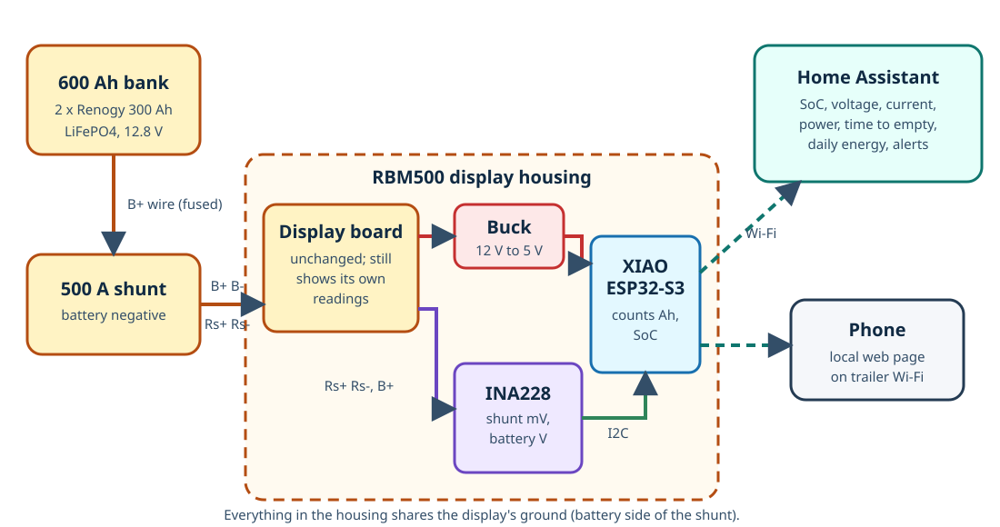
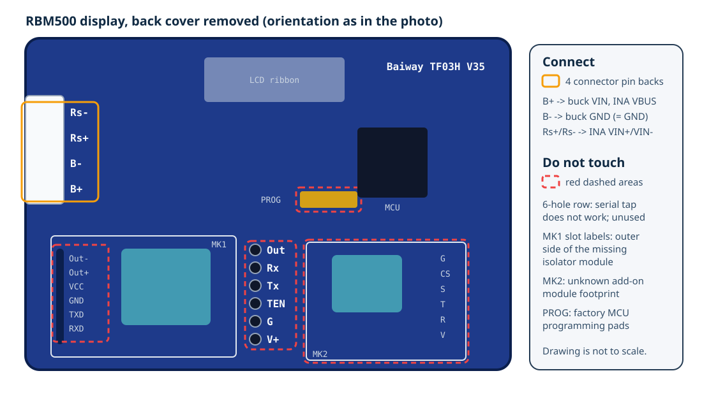
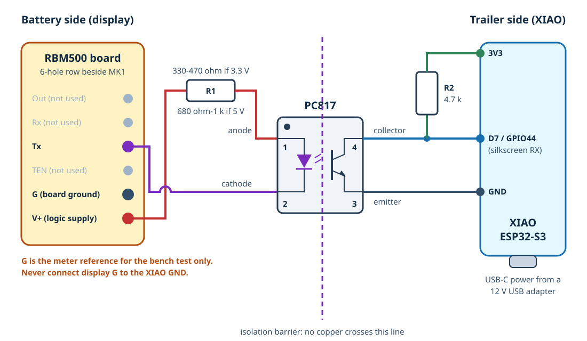
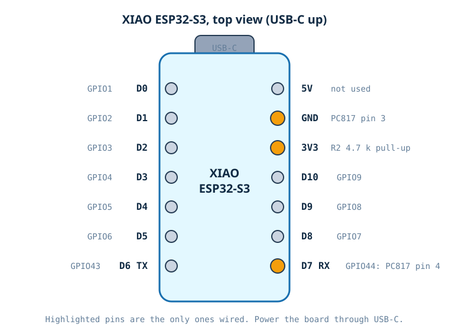

# Renogy Battery Monitor to Home Assistant (XIAO ESP32-S3)

A Seeed Studio XIAO ESP32-S3 reads the Renogy 500 A Battery Monitor with Shunt (RBM500) in the Casita travel trailer and publishes state of charge, voltage, current, power, remaining amp-hours and time remaining to Home Assistant. It also serves a small local web page so a phone on the trailer's Wi-Fi can check the battery without Home Assistant.

The RBM500 has no Bluetooth or data port, and Renogy sells no add-on for it. Inside, its display is a Baiway TF03H V35 board. Baiway's TF03 meters can be built with an optional TTL serial output; on this unit, the isolator module (`MK1`) is not fitted, but the board's serial transmit line is exposed on a row of holes beside the empty footprint. This project taps that line through a PC817 optocoupler, so the trailer's 12 V system and the battery-side meter electronics never share a ground.



> [!IMPORTANT]
> **Status: design documented, not yet built.** The ESPHome configuration validates and compiles (ESPHome 2026.9.1), but no hardware has been assembled. The design assumes this display's firmware transmits frames on the `Tx` hole even though the isolator module is missing. [Step 1](#step-1-confirm-the-display-transmits-bench-test) confirms that with a $5 USB-serial adapter before you solder anything permanent. If no frames appear, stop: this approach will not work on your unit.

## How It Works

1. The 500 A shunt sends analog sense signals (`Rs+`, `Rs-`) and battery voltage (`B+`, `B-`) to the display. That cable carries no data.
2. The display's microcontroller computes the readings and, about once per second, sends a 16-byte frame out of its serial transmit pin: 9600 baud, 8 data bits, no parity, 1 stop bit.
3. The `Tx` signal drives the LED in a PC817 optocoupler. The phototransistor on the other side pulls the XIAO's `D7` (GPIO44) input low whenever `Tx` is low, so the XIAO sees the same serial stream with no electrical connection to the display.
4. ESPHome decodes each frame with the open-source [`tf03k_shunt` component](https://github.com/edillmann/esphome-tf03k-smart-shunt) and publishes the values to Home Assistant over Wi-Fi.

### Frame format

| Bytes | Content | Units |
| --- | --- | --- |
| 1 | Header `0xA5` | |
| 2 | State of charge | % |
| 3-4 | Battery voltage | 10 mV |
| 5-8 | Remaining capacity | mAh |
| 9-12 | Current, signed (negative = discharging) | mA |
| 13-15 | Time remaining | seconds |
| 16 | Checksum: 8-bit sum of bytes 1-15 | |

All multi-byte values are big-endian. Source: Baiway's TF03K communication specification, as reproduced in the component repository.

### Known limitations

- **The display only transmits while it is awake.** Renogy's manual says the monitor enters a low-power sleep and turns off its backlight when battery current is low, and Baiway's specification says frames are sent only while the meter is working (backlight on). While the display sleeps, the `Monitor Online` entity turns off after 60 seconds and Home Assistant keeps the last values. Pressing any button on the display wakes it for about 10 seconds. With the trailer's 12 V fridge cycling, the display will usually be awake, but expect gaps when the trailer is idle.
- **The XIAO adds load.** It draws roughly 0.1 A at 5 V with Wi-Fi active, which is about 0.05 A from the 12 V system, or roughly 1.2 Ah per day through a USB adapter. Unplug it when the trailer is stored.
- **Remote reading away from home needs a network path.** See [Reading the battery away from home](#reading-the-battery-away-from-home).

## Parts

| Component | Quantity | Notes | Purchase link |
| --- | ---: | --- | --- |
| Seeed Studio XIAO ESP32-S3 | 1 | Already owned. Any ESP32 works if you change the board and pin in the YAML | [Seeed](https://www.seeedstudio.com/XIAO-ESP32S3-p-5627.html) |
| PC817 optocoupler | 1 | DIP-4 through-hole. CTR of at least 50% at 5 mA | Any electronics supplier |
| R1: LED resistor | 1 | 330-470 ohm if the display's `V+` measures about 3.3 V; 680 ohm-1 kohm if it measures about 5 V. 1/4 W | |
| R2: pull-up resistor | 1 | 4.7 kohm, 1/4 W | |
| Small perfboard | 1 | About 3 x 3 cm, enough for the PC817 and two resistors | |
| Thin stranded hookup wire | About 1 m | 26-28 AWG silicone wire for the display board; three colors | |
| 3-conductor cable | As needed | Opto board to XIAO (3V3, signal, GND). Keep under about 2 m | |
| 12 V USB adapter and USB-C cable | 1 | A 12 V USB socket or hardwired 12 V to USB-C module on a fused trailer circuit | |
| Small enclosure for the XIAO | 1 | Keep the antenna end clear of metal | |
| USB-to-TTL serial adapter | 1 | For the bench test only. Must support 3.3 V logic (CP2102, CH340 or FTDI) | |
| Heat-shrink tubing, hot glue or Kapton tape | As needed | Insulation and strain relief | |

## Tools and Supplies

- Fine-tip soldering iron, solder, flux and solder wick or a desoldering pump
- Multimeter with DC voltage and continuity
- Small screwdrivers and a drill for a cable hole in the display's back cover
- Laptop running on its battery for the bench test (not plugged into a charger)

## Where to Connect on the Display Board



With the back cover removed and the white shunt plug on the left edge, the empty `MK1` footprint is at the lower left. The vertical row of six holes immediately to its right is labeled, top to bottom, `Out`, `Rx`, `Tx`, `TEN`, `G` and `V+`. These are the microcontroller side of the missing isolator module.

| Hole | Use |
| --- | --- |
| `Tx` | Microcontroller serial transmit. Goes to PC817 pin 2 (cathode) |
| `V+` | Board logic supply. Goes through R1 to PC817 pin 1 (anode) |
| `G` | Board ground (battery negative, battery side of the shunt). Meter reference for the bench test only |
| `Out`, `Rx`, `TEN` | Not used. Leave unconnected |

Do not touch:

- **The slot labels `Out-`, `Out+`, `VCC`, `GND`, `TXD`, `RXD`.** These are the outer side of the missing isolator. There is nothing to connect to.
- **`MK2`** (pads `G`, `CS`, `S`, `T`, `R`, `V`). An unpopulated footprint for an unknown add-on module.
- **`PROG`.** Factory programming pads for the microcontroller.
- **The shunt plug** (`Rs-`, `Rs+`, `B-`, `B+`).

Photograph the board before modifying it and save the photo as `photos/rbm500-board-back.jpg`.

## Wiring



| From | To | Notes |
| --- | --- | --- |
| Display `V+` | R1, then PC817 pin 1 (anode) | R1 value depends on the measured `V+` voltage |
| Display `Tx` | PC817 pin 2 (cathode) | LED lights when `Tx` is low |
| PC817 pin 4 (collector) | XIAO `D7` (GPIO44) | Serial data into the XIAO |
| PC817 pin 4 (collector) | R2 (4.7 kohm), then XIAO `3V3` | Pull-up; idle line reads high |
| PC817 pin 3 (emitter) | XIAO `GND` | |
| Display `G` | Nothing | **Never connect to the XIAO side** |
| 12 V USB adapter | XIAO USB-C | Power |

The circuit is non-inverting: when the display's `Tx` line goes low, the LED turns on, the transistor turns on and `D7` reads low. When `Tx` is high (idle), the LED is off and R2 pulls `D7` high.

### Why the isolation matters

The display's ground is the battery negative on the **battery side** of the shunt. The trailer's 12 V negative, which powers the XIAO, is on the **load side**. If the XIAO's ground were connected to the display's ground, that thin signal wire would become a second path around the shunt:

- Some current would bypass the shunt, so the readings would be slightly wrong.
- If the main negative cable ever came loose, the trailer's entire load current would try to flow through the signal wire, which could start a fire.

The PC817 keeps the two sides separate, which is exactly what Baiway's own isolator module does.

### XIAO ESP32-S3 pins



Only `3V3`, `GND` and `D7` (GPIO44) are wired. Logging stays on the native USB port (`USB_SERIAL_JTAG`), so the UART pins are free.

## Build

### Step 1: Confirm the display transmits (bench test)

Do this before buying parts or modifying the display permanently.

1. Power down the display by unplugging the shunt cable from it. Remove the back cover.
2. Clear the solder from the `Tx`, `G` and `V+` holes with wick or a pump, or plan to tack wires onto the top of the pads.
3. Solder a short temporary wire to each of `Tx`, `G` and `V+`. Insulate the ends.
4. Reconnect the shunt cable so the display powers up. Measure DC voltage from `G` to `V+` and write it down. It sets R1's value.
5. Set the USB-to-TTL adapter to 3.3 V logic if `V+` measured about 3.3 V. Do not connect a 3.3 V adapter to a 5 V line without checking that its input is 5 V-tolerant.
6. Unplug the laptop from its charger. A grounded laptop must not connect to the battery-side ground.
7. Connect only adapter `GND` to display `G` and adapter `RX` to display `Tx`. Leave the adapter's `TX` and power pins unconnected.
8. Open a serial terminal in hex mode at 9600 baud, 8N1. Press a display button to wake it.
9. You should see a 16-byte frame starting with `A5` about once per second. Check one frame: bytes 3-4 divided by 100 should equal the voltage on the display.
10. Disconnect the adapter.

If no frames appear, try waking the display again and confirm the voltage on `Tx` toggles. If there is still nothing, the firmware does not transmit without the isolator module. Stop here and use a shunt with built-in Bluetooth instead.

### Step 2: Prepare the display wires

1. Unplug the shunt cable from the display.
2. Remove the temporary `G` wire or cut it short and insulate it. It is not used in the final build.
3. Replace the `Tx` and `V+` wires with 26-28 AWG silicone wire long enough to reach the opto board. Use different colors and label them.
4. Secure the wires to the board with a dab of hot glue or Kapton tape so solder joints carry no strain.
5. Drill a small hole in the display's back cover for the cable, add a grommet or heat-shrink at the hole, and close the case.

### Step 3: Build the optocoupler board

1. Place the PC817 on the perfboard. Pin 1 has the dot. Pins 1 and 2 are on one side; pins 4 and 3 are directly opposite.
2. Solder R1 between the `V+` wire and pin 1. Solder the `Tx` wire to pin 2.
3. Solder R2 from pin 4 to the pad for the XIAO's `3V3` wire.
4. Connect the 3-conductor cable: pin 4 to the XIAO `D7` conductor, pin 3 to the XIAO `GND` conductor, and the far end of R2 to the XIAO `3V3` conductor.
5. Keep the display-side copper (pins 1 and 2, R1, `Tx`, `V+`) physically separated from the XIAO-side copper (pins 3 and 4, R2, cable) by at least a few millimetres, matching the barrier in the diagram.
6. Mount the board behind the display or in a small enclosure next to it.

### Step 4: Connect and power the XIAO

1. Solder the cable to the XIAO's `D7`, `3V3` and `GND` pins.
2. Before applying any power, use the multimeter's continuity mode to check:
   - display `G` to XIAO `GND`: **open** (no continuity)
   - display `V+` to XIAO `GND`: **open**
   - display `Tx` to XIAO `D7`: **open**
3. Mount the XIAO in its enclosure and power it from the 12 V USB adapter. Do not plug the XIAO into a computer and the trailer adapter at the same time.

## ESPHome Configuration

The configuration is [`esphome/casita-battery-monitor.yaml`](esphome/casita-battery-monitor.yaml). It pulls the `tf03k_shunt` component from [edillmann/esphome-tf03k-smart-shunt](https://github.com/edillmann/esphome-tf03k-smart-shunt) (Apache-2.0), pinned to commit `f248cd1f3e2ffa26eef3c8892f57fae07a0c58f9`, the 2026-09-08 "fix for esphome 2026.8" commit. Pinning prevents an upstream change from altering the firmware unexpectedly.

| Setting | Value |
| --- | --- |
| Board | `seeed_xiao_esp32s3`, ESP-IDF framework |
| UART | RX on GPIO44 (`D7`), 9600 baud, 8N1, internal pull-up enabled as a backup to R2 |
| Publish interval | 5 s (`refresh_interval` substitution) |
| Offline timeout | 60 s without a valid frame |
| Daily energy counters | `restore: false`, so they reset on reboot but do not wear the flash |
| Logger | USB, level `INFO` |
| Local web page | Port 80, password-protected (`web_username`, `web_password` secrets) |

Validation on bee2 with ESPHome 2026.9.1 on 2026-10-08: `esphome config` passed and `esphome compile` succeeded (RAM 30.0%, flash 47.4%). This proves only that the configuration builds. It has not run on hardware.

### Secrets

Copy [`esphome/secrets.example.yaml`](esphome/secrets.example.yaml) into ESPHome's `secrets.yaml` and replace every placeholder. Generate the API key with `openssl rand -base64 32`. ESPHome 2026.9 rejects the all-zeros placeholder key used in older examples.

## Home Assistant Setup

### 1. Add the configuration to ESPHome Device Builder

1. In Home Assistant, open **ESPHome Builder**.
2. Open **Secrets** (top-right menu) and add the keys from `secrets.example.yaml` with real values.
3. Select **+ New Device**, choose **Continue**, name it `casita-battery-monitor`, and skip the board-specific setup.
4. Open the new device's **Edit** view, replace its contents with `casita-battery-monitor.yaml`, and **Save**.
5. Select **Validate**. It downloads the pinned component from GitHub, so Home Assistant needs internet access.

### 2. Flash the XIAO over USB (first time only)

1. Connect the XIAO to your laptop with a USB-C data cable. Do not connect it to the opto board's cable yet if the trailer adapter is also connected.
2. In Device Builder choose **Install**, then **Plug into this computer**. Use Chrome or Edge.
3. If the port does not appear, hold the XIAO's **BOOT** button, tap **RESET**, release **BOOT**, and try again.
4. Wait for the install to finish, then open **Logs** to confirm it joins Wi-Fi.

After this, all updates install wirelessly with **Install** then **Wirelessly**.

### 3. Adopt the device in Home Assistant

1. Go to **Settings > Devices & services**. Home Assistant should show a discovered **ESPHome** device named **Casita Battery Monitor**.
2. Select **Configure** and paste the `api_encryption_key` from your secrets when asked.
3. Assign it to an area, such as "Casita".

If it is not discovered, select **Add Integration > ESPHome** and enter `casita-battery-monitor.local` or the device's IP address.

### 4. Check the entities

| Entity name | Likely entity ID | Unit |
| --- | --- | --- |
| State of Charge | `sensor.casita_battery_monitor_state_of_charge` | % |
| Voltage | `sensor.casita_battery_monitor_voltage` | V |
| Current | `sensor.casita_battery_monitor_current` | A (negative = discharging) |
| Power | `sensor.casita_battery_monitor_power` | W |
| Remaining Capacity | `sensor.casita_battery_monitor_remaining_capacity` | Ah |
| Time Remaining | `sensor.casita_battery_monitor_time_remaining` | duration |
| Daily Charged Energy | `sensor.casita_battery_monitor_daily_charged_energy` | kWh |
| Daily Discharged Energy | `sensor.casita_battery_monitor_daily_discharged_energy` | kWh |
| Monitor Online | `binary_sensor.casita_battery_monitor_monitor_online` | on/off |
| Wi-Fi Signal, Uptime, Restart | diagnostic and config entities | |

Home Assistant generates entity IDs from the device and entity names. Confirm the actual IDs on the device page and adjust the examples below if they differ.

Wake the display and confirm that **Monitor Online** turns on and that state of charge, voltage and current match the display. If a value looks wrong, set `logger: level: DEBUG`, reinstall, and watch the logs: the component prints every parsed frame and any checksum failures.

### 5. Dashboard card

```yaml
type: vertical-stack
cards:
  - type: gauge
    entity: sensor.casita_battery_monitor_state_of_charge
    name: Casita Battery
    min: 0
    max: 100
    severity:
      green: 50
      yellow: 25
      red: 0
  - type: entities
    entities:
      - entity: sensor.casita_battery_monitor_voltage
      - entity: sensor.casita_battery_monitor_current
      - entity: sensor.casita_battery_monitor_power
      - entity: sensor.casita_battery_monitor_remaining_capacity
      - entity: sensor.casita_battery_monitor_time_remaining
      - entity: binary_sensor.casita_battery_monitor_monitor_online
```

### 6. Low-battery alert (optional)

Replace `notify.mobile_app_your_phone` with your phone's notify service.

```yaml
alias: Casita battery low
triggers:
  - trigger: numeric_state
    entity_id: sensor.casita_battery_monitor_state_of_charge
    below: 25
    for: "00:05:00"
actions:
  - action: notify.mobile_app_your_phone
    data:
      title: Casita battery low
      message: >-
        Battery at {{ states('sensor.casita_battery_monitor_state_of_charge') }}%
        ({{ states('sensor.casita_battery_monitor_voltage') }} V).
mode: single
```

### 7. Local web page

On the trailer's Wi-Fi, open `http://casita-battery-monitor.local` (or the device's IP address) and log in with `web_username` and `web_password`. This works without Home Assistant.

## Reading the Battery Away From Home

ESPHome's Home Assistant connection is opened **by Home Assistant** to the device on port 6053. That works when the trailer is parked on the home Wi-Fi. When the trailer is elsewhere, the home Home Assistant cannot reach a device behind a campground or Starlink connection.

Options, not yet built or tested:

1. **Travel router with a VPN subnet route.** A router in the trailer, such as a GL.iNet running Tailscale, advertises the trailer's network as a subnet route, and the Home Assistant host accepts that route. Home Assistant then reaches the XIAO as if it were local. Give the XIAO a DHCP reservation so its address does not change.
2. **MQTT.** Add ESPHome's `mqtt:` component and publish to a broker reachable from both places. This works through any internet connection but needs a broker exposed securely.
3. **Local only.** Use the local web page at the campsite and let Home Assistant catch up when the trailer returns home.

## Testing Checklist

1. Bench test shows valid `A5` frames whose voltage matches the display.
2. Continuity checks show no connection between any display wire and any XIAO pin.
3. XIAO boots from the 12 V USB adapter and joins Wi-Fi.
4. **Monitor Online** turns on within a few seconds of waking the display.
5. Voltage, current and state of charge in Home Assistant match the display within rounding.
6. Turn on a known load, such as a light, and confirm current and power change in the right direction (negative while discharging).
7. Let the display sleep. **Monitor Online** turns off after about 60 seconds and turns back on after a button press.
8. Logs show no repeated checksum warnings. If they do, see Troubleshooting.

## Troubleshooting

| Symptom | Likely cause | Fix |
| --- | --- | --- |
| No data, `Monitor Online` stays off | Display asleep, `Tx` and `V+` swapped, or R1 too large | Press a display button; check wiring against the schematic; measure `V+` and recheck R1 |
| Checksum warnings in the logs | Slow optocoupler edges | Lower R2 to 2.2 kohm, or lower R1 slightly to increase LED current (stay under 10 mA) |
| Values frozen in Home Assistant | Display sleeping at low current | Expected. See Known limitations |
| Current sign looks backwards | Shunt `B-`/`P-` reversed | The display would also blink; correct the shunt wiring per Renogy's manual |
| Device not discovered | mDNS blocked between networks | Add the ESPHome integration manually by IP |
| USB flashing fails | Board not in download mode | Hold BOOT, tap RESET, release BOOT |

## Safety Notes

- Always unplug the shunt cable from the display before soldering on its board. The display is powered from the battery through the `B+` wire; confirm that wire is fused close to the battery.
- Never connect the display's `G` to the XIAO or to the trailer's 12 V negative. The optocoupler is the only connection between the two sides.
- Use a fused 12 V circuit for the USB adapter.
- Opening the display almost certainly voids Renogy's warranty on it.
- The XIAO and opto board are low-voltage, but keep them away from water, the battery terminals and high-current cables.

## Photos

Add photos to `photos/` as the build progresses:

- `rbm500-board-back.jpg`: the display board before modification
- `opto-board.jpg`: the finished optocoupler board
- `installed.jpg`: the display and XIAO installed in the trailer

## References

- [Renogy RBM500 product page](https://www.renogy.com/products/500a-battery-monitor-with-shunt) and [G3 manual](https://cdn.shopify.com/s/files/1/0631/0137/0483/files/RBM500-G3-Manual_26f37388-12d7-442a-99e6-77ee6e79f8bf.pdf)
- [edillmann/esphome-tf03k-smart-shunt](https://github.com/edillmann/esphome-tf03k-smart-shunt): ESPHome component and TF03K protocol notes
- [patrickwasp/tf03k](https://github.com/patrickwasp/tf03k): protocol diagram and notes that most TF03K units ship without the serial option
- [Seeed Studio XIAO ESP32-S3 wiki](https://wiki.seeedstudio.com/xiao_esp32s3_getting_started/)

## Revisions

| Date | Change |
| --- | --- |
| 2026-10-08 | Initial design, wiring, ESPHome configuration and Home Assistant setup (not yet built) |
