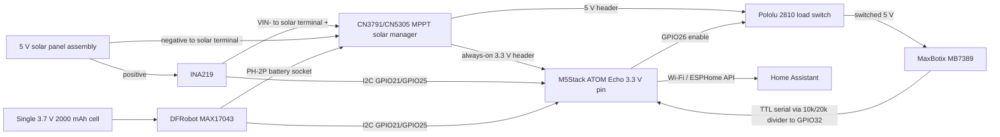
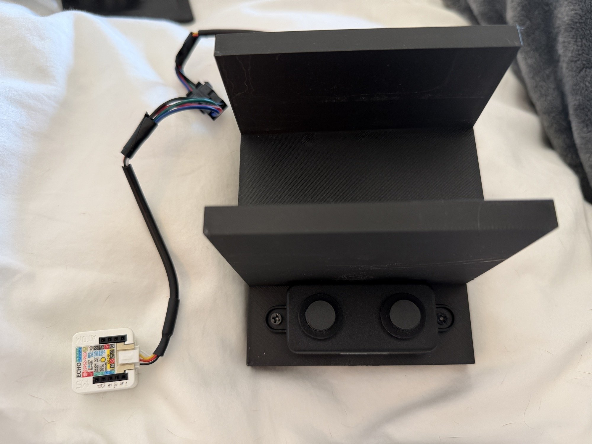
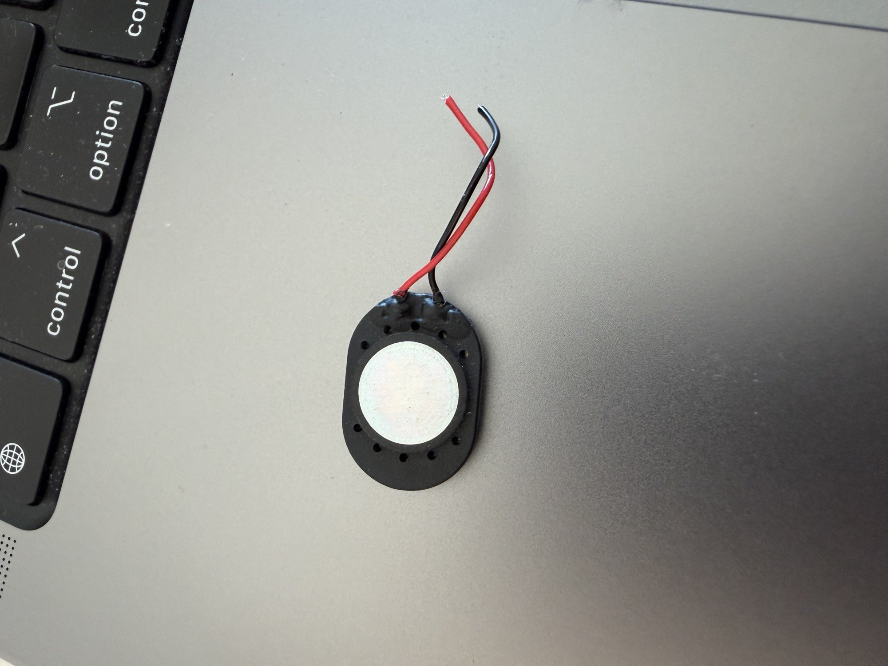
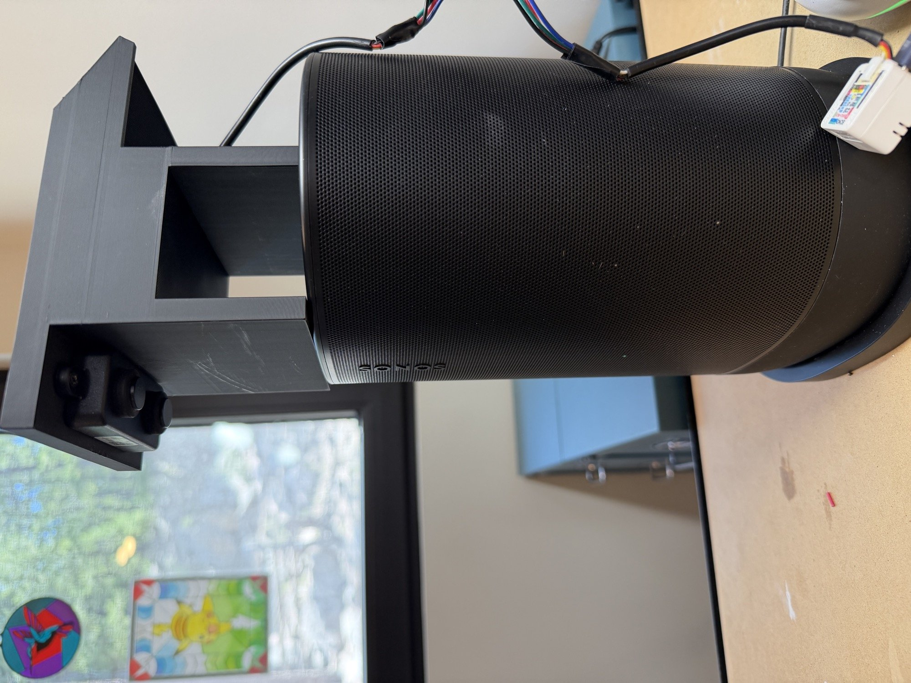

# Solar Snow Depth Sensor

This project measures the distance from a fixed outdoor mount to the snow surface and reports the calculated snow depth to Home Assistant through ESPHome. The current build uses an M5Stack ATOM Echo, a controlled-UART A02-style ultrasonic sensor, a solar power manager, two parallel 1S batteries, and battery/solar telemetry.

The project is still being commissioned. This document separates confirmed current hardware from planned changes so experimental work is not presented as a finished outdoor installation.

## Current Status

| Area | Status |
| --- | --- |
| Controller | M5Stack ATOM Echo with ESP32-PICO-D4; internal speaker removed to reduce deep-sleep current |
| Distance sensor | MaxBotix MB7389-100 installed and verified 2026-07-22 (true-TTL serial confirmed by meter; powered through a Pololu #2810 load switch on GPIO26; 10k + 2×10k-series divider to GPIO32) |
| Solar manager | CN3791/CN5305 MPPT solar manager board (rewire documented 2026-07-23); Waveshare (D) retired — its SW6106 power-bank output stage shut down under light load and on charge events |
| Battery pack | Single 3.7 V 2,000 mAh low-temperature-rated cell (confirmed 2026-07-22); a second matched parallel cell is planned but not installed |
| Battery protection | Cells currently have no individual positive-lead fuses; add suitable fusing before permanent outdoor use |
| Battery telemetry | DFRobot DFR0563/MAX17043 installed; voltage works. State of charge resets to nonsense after a deep discharge (observed 2026-07-19: ~1% at 3.5 V) and re-converges only slowly — trust voltage |
| Solar telemetry | INA219 installed in the panel-positive input path |
| Solar panel | NEWCONNY YXC-001, two 5 V/8 W panels advertised as 5 V/16 W combined |
| Panel compatibility | User reports that the panel charges through `SOLAR IN`, but its 5 V rating is below Waveshare's specified 6-24 V input range; replacement is planned |
| Firmware | MB7389 production configuration deployed over OTA 2026-07-22; 60-second-awake / 15-minute-sleep cycle verified; sensor power switched off during sleep |
| Calibration | The 37-inch bare-ground baseline is provisional; the final mount must be recalibrated away from nearby false-echo surfaces |
| Future sensor | MB7389-100 conversion COMPLETE (2026-07-22); A02-style sensor retired |

The two source documents are the [solar power and wiring guide](https://docs.google.com/document/d/1VBBSSxniEqbiaizXf9Yi6eJauWuF1qXN0pcVBxjVYyE/edit) and the [MB7389 conversion guide](https://docs.google.com/document/d/150faQQos0u_JAVHEJ2jF1tBTAhe6uCM2jp9b6NgIEto/edit).

## System Overview



This diagram reflects the power rewire documented 2026-07-23 around the CN3791/CN5305 MPPT solar manager (5–24 V solar input — the 5 V panel is finally inside the input window). The Waveshare (D) is retired: its SW6106 power-bank output stage shut the ESP32 down three ways in 48 hours (light-load auto-off, low-current-mode dropout, charge-event kill).

## Parts

| Component | Quantity | Current role | Source |
| --- | ---: | --- | --- |
| M5Stack ATOM Echo / Atom Voice | 1 | ESP32-PICO-D4 controller | [M5Stack](https://docs.m5stack.com/en/atom/atomecho), [Amazon](https://www.amazon.com/dp/B0C7QSVPB2) |
| Gugxiom controlled-UART ultrasonic sensor | 1 | Current distance sensor; Amazon ASIN `B0CFFQNXDT` | [Amazon](https://www.amazon.com/dp/B0CFFQNXDT) |
| CN3791/CN5305 MPPT solar manager board | 1 | Solar/USB-C charging plus always-on 5 V/2A and 3.3 V/1A outputs | [Amazon](https://a.co/d/08eKKVoD) |
| Waveshare Solar Power Manager (D) | 1 | RETIRED 2026-07-23 — power-bank output stage unsuitable for deep-sleep loads | [Waveshare](https://www.waveshare.com/solar-power-manager-d.htm) |
| Low-temperature-rated 3.7 V cells | 2 | Parallel 1S2P battery pack; exact model not recorded | Not recorded |
| DFRobot Gravity MAX17043, DFR0563 | 1 | Battery voltage and modeled state of charge | [DFRobot](https://www.dfrobot.com/product-1734.html) |
| Generic INA219 breakout | 1 | Panel input voltage/current/power | [Amazon](https://www.amazon.com/dp/B0CTYB69B5) |
| NEWCONNY YXC-001 / NCY002 panel assembly | 1 set | Two 5 V/8 W panels, advertised as 5 V/16 W combined | [Amazon](https://www.amazon.com/dp/B0DZC69ZHL) |

### Planned MB7389 Conversion

| Component | Quantity | Purpose | Source |
| --- | ---: | --- | --- |
| MaxBotix MB7389-100 | 1 | Narrower-beam, weather-resistant replacement sensor | [MaxBotix datasheet](https://maxbotix.com/pages/hrxl-maxsonar-wr-datasheet) |
| Pololu item 2810 | 1 | High-side switch that removes sensor power during deep sleep | [Pololu](https://www.pololu.com/product/2810) |
| 10 kOhm and 20 kOhm resistors | 1 each | Divide the 5 V serial output to about 3.3 V |
| 100 uF electrolytic capacitor | 1 | Sensor supply filtering |
| 0.1 uF ceramic capacitor | 1 | Local high-frequency supply decoupling |

## Current Wiring

### ATOM Echo and Controlled Ultrasonic Sensor

| ATOM Echo | Sensor | Purpose |
| --- | --- | --- |
| `5V` | `VCC` | Sensor power |
| `GND` | `GND` | Common return |
| GPIO26 / Grove yellow | Control lead | A 100 ms pulse requests one measurement frame |
| GPIO32 / Grove white | Sensor TX | 9600-baud UART receive |

This Amazon sensor is not confirmed to be a genuine DFRobot A02YYUW. Live testing showed that it emits one four-byte UART frame only after the GPIO26 control pulse, which matches a controlled A02-family variant rather than the automatically streaming A02YYUW.

### Shared I2C Bus

| ATOM Echo | MAX17043 | INA219 |
| --- | --- | --- |
| `3.3V` | `VCC` | `VCC` |
| `GND` | `GND` | `GND` |
| GPIO21 | `SDA` | `SDA` |
| GPIO25 | `SCL` | `SCL` |

The expected I2C addresses are `0x36` for the MAX17043 and `0x40` for the INA219. M5Stack reserves GPIO19, GPIO22, GPIO23, and GPIO33 for ATOM Echo audio hardware; do not reuse them externally.

### Solar Input and INA219

| From | To |
| --- | --- |
| Panel positive | INA219 `VIN+` |
| INA219 `VIN-` | MPPT board solar terminal `+` |
| Panel negative | MPPT board solar terminal `-` |
| INA219 `VCC`, `GND`, `SDA`, `SCL` | ATOM Echo shared 3.3 V I2C bus |

This placement measures panel-side input voltage, current, and power. It does not measure exact battery charge current because the manager also supplies the load and incurs conversion losses.

**Known mismatch:** Waveshare specifies a raw 6-24 V source at `SOLAR IN`, while the linked NEWCONNY assembly is rated 5 V. The current setup is reported to work, but it is outside the published input specification. Verify voltage at `SOLAR IN` under load and replace the panel with a compatible raw-output model. A regulated 5 V source belongs on the Waveshare Type-C charging input, but measuring that route requires an inline breakout instead of the present screw-terminal wiring.

Live telemetry on 2026-07-20 showed the practical consequence of the mismatch: under charge load the panel is pulled to about 4.8 V, and in weak evening light the manager repeatedly stops drawing. The panel then floats at its ~7.8-8 V open-circuit voltage at ~1 mA for seconds to minutes before the next retry, while midday charging works. Treat "8 V on the INA219 with no current" as the charger backing off, not as the panel producing power.

### Battery Pack and MAX17043

| From | To |
| --- | --- |
| Parallel pack positive | MAX17043 `BT1/PH2` positive |
| Parallel pack negative | MAX17043 `BT1/PH2` negative |
| MAX17043 `P1` positive/negative | MPPT board PH-2P battery socket (verify polarity with a meter; leave the 18650 holder empty) |
| MAX17043 I2C header | ATOM Echo shared 3.3 V I2C bus |

The installed battery is currently a single 2,000 mAh low-temperature-rated cell (its exact model and charge-temperature limit are still unrecorded); the 1S2P parallel upgrade below is planned but not yet built. Before permanent use:

1. Verify both cells are identical in model, capacity, age, condition, and protection type.
2. Verify their voltages are within a few hundredths of a volt before joining them.
3. Add a correctly rated fuse to each positive lead before the leads join. Select the rating from the confirmed cell, wire, and load limits; do not guess from the nominal capacity alone.
4. Treat the parallel group as one permanent 1S2P pack and do not add another unmatched cell through the Waveshare holder.

The MAX17043 measures pack voltage and estimates state of charge; it does not measure current. A live reading of about 4.191 V accompanied by 84% showed that voltage is currently more trustworthy than the uncalibrated percentage.

### Power Outputs (CN3791/CN5305 MPPT board)

| MPPT board | Destination |
| --- | --- |
| 3.3 V header `+` | ATOM Echo `3.3V` pin — always-on ESP32 supply; the ATOM `5V` pin is now unused |
| 5 V header `+` | Pololu #2810 `VIN` — switched MB7389 supply, enabled by GPIO26 |
| `GND` | Common ground |

The 3.3 V rail has no load detection or power-bank logic and cannot shut itself off; the button on the board is only needed once after connecting a battery or after a 2.9 V deep-discharge cutoff. Set the MPPT DIP switch to its lowest position for the 5 V panel, and never feed the solar input and USB-C charge input simultaneously. Disconnect the 3.3 V feed before attaching USB to the ATOM Echo for flashing, and reconnect afterward.

## ESPHome Configuration

The repository contains two credential-free configurations:

- [`esphome/snow-depth-sensor-diagnostic.yaml`](esphome/snow-depth-sensor-diagnostic.yaml) mirrors the diagnostic firmware that ran on the node until 2026-07-20. It prevents deep sleep, logs UART frames, disables Wi-Fi power saving, and triggers the sensor every second.
- [`esphome/snow-depth-sensor-production.yaml`](esphome/snow-depth-sensor-production.yaml) is the previously tested low-power configuration. It stays awake for 60 seconds, sleeps for 15 minutes, gathers 12 samples, and publishes a five-sample median.
- [`esphome/secrets.example.yaml`](esphome/secrets.example.yaml) lists the private values each configuration expects. Never commit the real secrets file.

The production configuration was deployed to the live node on 2026-07-20 (compile and OTA through the ESPHome Device Builder) and the complete cycle was verified the same day: about 60 seconds awake publishing a median distance plus battery and solar telemetry, then 15 minutes asleep. The diagnostic configuration remains available for future sensor work — hold the node awake with the "Snow Sensor OTA Mode" switch during a wake window before flashing.

## Snow Depth Calculation

Use the stable sensor reading over bare ground or deck as the baseline rather than relying only on a tape measurement:

```text
snow_depth_inches = max(0, (bare_ground_mm - current_distance_mm) / 25.4)
```

The existing 37-inch baseline is provisional. Recalibrate after the final sensor and mount are installed, then test with flat targets at several known heights.

Home Assistant uses restart-safe template sensors to preserve the last distance, snow depth, battery, and solar readings while the ESP32 is asleep. The sleeping ESPHome entities alone should not be treated as continuously available measurements.

## Mounting and False Echoes

Testing at a physical 12-inch distance produced readings near 3.1-3.5 inches when the current sensor was beside the backing wall/shroud. Move the transducer clear of vertical faces, enclosure lips, rails, and 90-degree corners before calibrating.

A 3D-printable angled hood/mount for the sensor is included at [`model/snow-sensor-mount.3mf`](model/snow-sensor-mount.3mf). It shades the transducer face and sheds accumulation, but final placement must still respect the false-echo clearances above.



The ATOM Echo speaker was removed after testing showed that the audio circuit dominated deep-sleep current. The USB meter then displayed less than its 0.00 A resolution.



The test mount below is useful for diagnosing the false return but is not the final outdoor geometry.



## MB7389 Upgrade Plan

The MaxBotix conversion was completed on 2026-07-22 (see [`esphome/snow-depth-sensor-mb7389-production.yaml`](esphome/snow-depth-sensor-mb7389-production.yaml) for the deployed configuration). It retains GPIO32 for 9600-8-N-1 UART and repurposes GPIO26 to control the Pololu high-side switch.

| Connection | Destination |
| --- | --- |
| Waveshare 5 V output | Pololu switch `VIN` |
| Pololu `VOUT` | MB7389 pin 6 (`V+`) |
| ATOM GPIO26 | Pololu switch enable/control |
| Common ground | Pololu ground and MB7389 pin 7 |
| MB7389 pin 5 TTL serial | 10 kOhm resistor, then GPIO32 |
| GPIO32 side of divider | 20 kOhm resistor to ground |
| 100 uF and 0.1 uF capacitors | Across MB7389 pins 6 and 7 |

Leave MB7389 pins 1-4 unconnected for the initial free-running, internally filtered serial configuration. The sensor emits `Rdddd` followed by carriage return, where `dddd` is millimeters; `5000` means no target detected. Reject values below 300 mm and at or above 5000 mm.

When powered from 5 V, the MB7389 serial high level can approach 5 V and must not connect directly to the 3.3 V ESP32 input. The 10 kOhm/20 kOhm divider reduces it to about 3.33 V. Do not power the sensor from a GPIO; official data lists about 3.1 mA nominal and approximately 98 mA peak at 5 V.

The MB7389 reports a minimum distance of 300 mm, but MaxBotix recommends at least 500 mm where reading-to-reading reliability is critical. Do not describe its beam as a fixed 11-degree cone; use the target-size-specific plots in the official datasheet. Mount the horn straight down and keep walls, posts, enclosure edges, and roof edges outside those plotted beam envelopes.

## Commissioning Checklist

1. Add and verify individual battery fuses before permanent installation.
2. Record the exact battery model, allowed charge-temperature range, and fuse rating.
3. Measure panel voltage at the manager under load and replace the 5 V panel with a 6-24 V raw-output panel for specification-compliant `SOLAR IN` operation.
4. Confirm I2C devices at `0x36` and `0x40` and verify plausible voltage/current values.
5. Move the sensor clear of the false-echo surface.
6. Record a stable bare-ground baseline and test several known target heights.
7. Restore production firmware and verify the complete 60-second wake and 15-minute sleep cycle. **Done 2026-07-20:** deployed over OTA; two sleep transitions and a scheduled wake observed live.
8. Superseded 2026-07-23: run the MPPT-board burn-in instead — 24 h of unattended wake/sleep cycles on battery only, plus a charger plug/unplug during a sleep window, with the output surviving both.
9. Weatherproof rear electronics, cable entries, solder joints, and the battery compartment while allowing condensation control.
10. Verify OTA maintenance mode keeps the node awake through a complete update.

## Schematics and References

[`schematics/README.md`](schematics/README.md) catalogs every official board schematic, datasheet, pin map, protocol document, and mechanical drawing found for the current and planned hardware. Manufacturer documents are linked rather than copied because their publication does not grant redistribution rights.

## Safety Notes

- Disconnect the panel, battery, USB, and regulated output before changing wiring.
- Verify every battery and connector polarity with a multimeter; connector housing orientation is not a polarity standard.
- Never parallel cells at materially different voltages or mix cell models, ages, capacities, or protection types.
- The exact installed cell model must be recorded before relying on any low-temperature charging claim.
- Do not operate the 5 V panel on `SOLAR IN` as a validated production design merely because it appears to charge; it is below the published input range.
- Protect the battery system from water, abrasion, crushing, puncture, and direct solar heating.
- Add strain relief and suitable overcurrent protection before unattended outdoor operation.

## Revisions

| Date | Change |
| --- | --- |
| 2026-07-18 | Initial project documentation from the live configuration, Google Docs, Codex design session, and build photos |
| 2026-07-19 | Overnight deep discharge in diagnostic mode; MAX17043 state-of-charge reset observed, voltage remained trustworthy |
| 2026-07-20 | Production low-power firmware deployed over OTA; wake/sleep cycle verified; weak-light charging hiccup characterized |
| 2026-07-21 | Documentation reconciled and merged to main; printable sensor hood model added |
| 2026-07-22 | MB7389 conversion completed and verified: TTL serial confirmed (no RX inversion), serial divider corrected to series resistors, Pololu #2810 switched power, production deep-sleep firmware deployed |
| 2026-07-23 | Power system rewired (documented): Waveshare (D) retired after light-load auto-off, mode dropout, and charge-event shutdowns; CN3791/CN5305 MPPT board provides always-on 3.3 V ESP32 feed and switched 5 V sensor rail |
