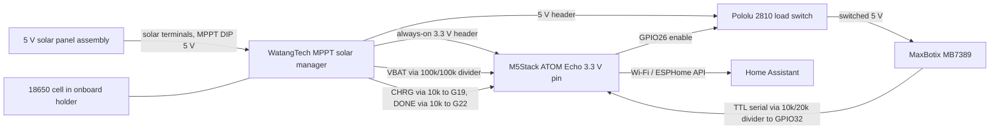

# Solar Snow Depth Sensor

This project measures the distance from a fixed outdoor mount to the snow surface and reports the calculated snow depth to Home Assistant through ESPHome. The build uses an M5Stack ATOM Echo, a MaxBotix MB7389 ultrasonic sensor behind a GPIO-switched load switch, a CN3791/CN5305 MPPT solar manager with an always-on 3.3 V output, an 18650 cell in the board's onboard holder, and battery/charge telemetry read from the board's VBAT/CHRG/DONE monitoring header via reclaimed ATOM audio pins.

The system is bench-verified and awaiting final outdoor mounting and bare-ground baseline calibration.

## Documentation

- **[Solar Power Board Guide](docs/solar-power-board-guide.md)** — CN3791/CN5305 MPPT board setup, complete power wiring, rewire procedure, and burn-in acceptance test
- **[MB7389 Sensor Guide](docs/mb7389-sensor-guide.md)** — sensor wiring, serial divider, capacitors, ESPHome configuration, mounting constraints, and calibration

## Current Status

| Area | Status |
| --- | --- |
| Controller | M5Stack ATOM Echo (ESP32-PICO-D4); internal speaker removed to reduce deep-sleep current |
| Distance sensor | MaxBotix MB7389-100 installed and verified 2026-07-22 (true-TTL serial confirmed; 10k + 2×10k-series divider to GPIO32) |
| Sensor power | Pololu #2810 load switch on GPIO26; sensor fully off during deep sleep |
| Power manager | CN3791/CN5305 MPPT solar manager board: always-on 3.3 V to the ATOM, 5 V rail for the sensor (rewire documented 2026-07-23) |
| Battery | 18650 cell in the MPPT board's onboard holder; labeled 4,000 mAh (unverified — discharge run will measure true capacity); pouch cell and MAX17043 pass-through retired 2026-07-24 |
| Battery telemetry | Board VBAT header → 100k/100k divider → GPIO33 ADC: voltage plus discharge-curve percentage (calibration run pending) |
| Charge telemetry | CHRG → GPIO19 (charging binary sensor); DONE → GPIO22 feeding a per-wake **latch** ("Charge Complete" = DONE asserted at any point in the wake window — defeats the load-sag sampling problem) |
| Solar panel | NEWCONNY YXC-001, two 5 V/8 W panels; wired directly to the solar terminals (MPPT DIP at the 5 V setting) |
| Firmware | Production low-power configuration: 60 s awake / 15 min deep sleep, verified live |
| Calibration | Bare-ground baseline pending final outdoor mount |

## System Overview



## Parts

| Component | Quantity | Role | Source |
| --- | ---: | --- | --- |
| M5Stack ATOM Echo | 1 | ESP32-PICO-D4 controller (speaker removed) | [M5Stack](https://docs.m5stack.com/en/atom/atomecho), [Amazon](https://www.amazon.com/dp/B0C7QSVPB2) |
| MaxBotix MB7389-100 (HRXL-MaxSonar-WRMT) | 1 | Distance sensor: 300–5000 mm, 1 mm resolution, temperature-compensated, 3/4-in NPS housing | [MaxBotix](https://maxbotix.com/products/mb7389) |
| Pololu Mini MOSFET Slide Switch LV (#2810) | 1 | GPIO26-controlled sensor power switch (slide switch stays OFF) | [Pololu](https://www.pololu.com/product/2810) |
| WatangTech MPPT solar manager board (CN3791/CN5305) | 1 | Solar/USB-C charging plus always-on 5 V/2A and 3.3 V/1A outputs | [Amazon](https://a.co/d/08eKKVoD) |
| 18650 Li-ion cell | 1 | Battery, in the MPPT board's onboard holder. Labeled 4,000 mAh — treat skeptically (real 18650s top out ~3,500 mAh); true capacity to be measured by the 2026-07 discharge run | Not recorded |
| NEWCONNY YXC-001 panel assembly | 1 set | Two 5 V/8 W panels | [Amazon](https://www.amazon.com/dp/B0DZC69ZHL) |
| 10 kΩ resistors ×3 (one series + two in series as the 20 kΩ shunt) | 3 | 5 V→3.3 V serial divider | |
| 100 µF electrolytic + 0.1 µF ceramic | 1 each | Sensor supply decoupling at the sensor pins | |
| 100 kΩ resistors | 2 | VBAT voltage divider into GPIO33 | |
| 10 kΩ resistors | 2 | Series protection on the CHRG/DONE monitoring lines | |

## Wiring Summary

Full step-by-step wiring lives in the two guides above. The short version:

| From | To | Notes |
| --- | --- | --- |
| MPPT board 3.3 V header | ATOM Echo `3.3V` pin | Always-on ESP32 supply; the ATOM `5V` pin is unused |
| MPPT board 5 V header | Pololu #2810 `VIN` | Switched sensor supply |
| ATOM GPIO26 | Pololu #2810 `ON` pin | 100 kΩ pulldown to GND; sensor off during sleep |
| Pololu `VOUT` | MB7389 pin 6 (V+) | 100 µF + 0.1 µF across pins 6/7 at the sensor |
| MB7389 pin 5 | 10 kΩ → GPIO32, 20 kΩ → GND | TTL serial, idle high, 9600 8-N-1 |
| 18650 cell | MPPT board onboard holder | Negative first, observe polarity; PH-2P socket unused |
| Panel + / − | MPPT board solar terminals | Direct connection; MPPT DIP at the 5 V setting |
| MPPT `VBAT` | 100k → junction → GPIO33; junction → 100k → GND | Battery voltage ADC (×2 in firmware) |
| MPPT `CHRG` | 10 kΩ → GPIO19 | Charging status, active low, internal pull-up |
| MPPT `DONE` | 10 kΩ → GPIO22 | Charge complete, active low, internal pull-up |

GPIO19/22/33 are reclaimed ATOM Echo audio pins — safe in this build because the speaker was removed and the microphone is unused (they attach only to unused audio-chip inputs). GPIO23 stays unused (entangled with the mic); GPIO21/25 are free since the I2C monitors were retired. Disconnect the 3.3 V feed before flashing the ATOM over USB.

## ESPHome Configuration

The deployed configuration is [`esphome/snow-depth-sensor-mb7389-production.yaml`](esphome/snow-depth-sensor-mb7389-production.yaml) (60 s wake / 15 min deep sleep; UART-debug-hook frame parser; median-filtered distance; battery and solar telemetry). Copy [`esphome/secrets.example.yaml`](esphome/secrets.example.yaml) values into the private ESPHome `secrets.yaml`. For OTA updates of this deep-sleep device, turn on the "Snow Sensor OTA Mode" switch during a wake window first.

## Snow Depth Calculation

```text
snow_depth_inches = max(0, (bare_ground_mm - current_distance_mm) / 25.4)
```

Use the stable sensor reading over bare ground as the baseline, not a tape measurement. Reject 5000 mm ("no target") and values below 300 mm (min-range clamp); the firmware already does both. Home Assistant template sensors preserve the last readings while the ESP32 sleeps.

Mounting math: maximum measurable snow ≈ mounting height − 11.8 in (the sensor's 300 mm minimum range). 40–48 in above bare ground is the sweet spot; keep walls, posts, and 90° corners out of the ~11° beam. Full constraints in the [sensor guide](docs/mb7389-sensor-guide.md).

## Photos

| | |
| --- | --- |
| <br>Bench assembly (pre-MB7389) | <br>ATOM Echo, speaker removed |
| <br>Mounting test (false-echo lesson: keep surfaces out of the beam) | |

Photos of the MB7389 build and final outdoor mount still to be added.

## Commissioning Checklist (remaining)

1. Run the MPPT-board burn-in: 24 h of unattended wake/sleep cycles on battery only, plus a charger plug/unplug during a sleep window, with the output surviving both.
2. Add and verify a battery fuse before permanent installation; record the exact cell model and charge-temperature range.
3. Confirm the Charging binary sensor turns on in sunlight and Charge Complete at 4.2 V.
4. Mount outdoors per the beam-clearance rules, record the bare-ground baseline, and update the Home Assistant snow-depth calculation.
5. Add a hardware low-temperature charge cutoff before winter (the cell must not charge below 0 °C).
6. Weatherproof rear electronics, cable entries, and the battery compartment; verify OTA mode still works through a complete update.

## Schematics and References

[`schematics/README.md`](schematics/README.md) catalogs manufacturer documentation for the hardware. Manufacturer documents are linked rather than copied where redistribution rights are unclear.

## Safety Notes

- Disconnect the panel, battery, and charger before changing wiring; verify every polarity with a multimeter — connector housings are not a polarity standard.
- The cell may only be charged between 0 and 45 °C; the hardware cold-charge cutoff is mandatory for winter deployment.
- When paralleling cells: identical model/capacity/age, voltages matched within a few hundredths, and an individual fuse per positive lead.
- Never feed the MPPT board's solar input and USB-C charge input at the same time.
- Protect the battery from water, crushing, puncture, and direct solar heating; add strain relief before unattended outdoor operation.

## Revisions

| Date | Change |
| --- | --- |
| 2026-07-18 | Initial project documentation from the live configuration, Google Docs, Codex design session, and build photos |
| 2026-07-19 | Overnight deep discharge in diagnostic mode; MAX17043 state-of-charge reset observed, voltage remained trustworthy |
| 2026-07-20 | Production low-power firmware deployed over OTA; wake/sleep cycle verified; weak-light charging hiccup characterized |
| 2026-07-21 | Documentation reconciled and merged to main; printable sensor hood model added |
| 2026-07-22 | MB7389 conversion completed and verified: TTL serial confirmed (no RX inversion), serial divider corrected to series resistors, Pololu #2810 switched power, production deep-sleep firmware deployed |
| 2026-07-23 | Power system rewired: Waveshare (D) retired after light-load auto-off, mode dropout, and charge-event shutdowns; CN3791/CN5305 MPPT board provides always-on 3.3 V ESP32 feed and switched 5 V sensor rail |
| 2026-07-24 | Documentation restructured to current components only; historical guides and retired configs removed (preserved in git history) |
| 2026-07-24 | WatangTech board installed and flashed: battery moved to the onboard 18650 holder; MAX17043 and INA219 retired; VBAT/CHRG/DONE monitoring added on reclaimed audio pins G33/G19/G22; I2C bus removed |
