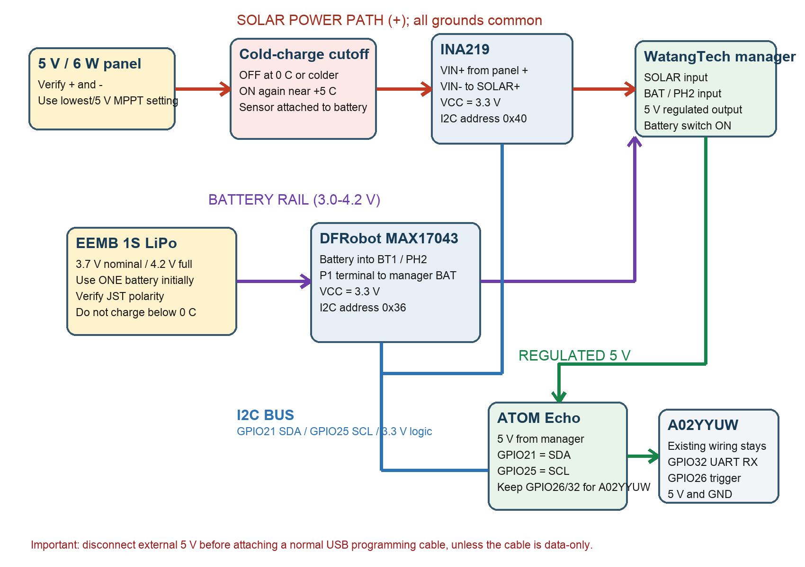

# Snow Depth Sensor

A solar-powered, battery-backed snow depth sensor. An ESP32 measures the
distance to the ground with an A02YYUW waterproof ultrasonic sensor; snow
accumulation shortens the measured distance. A solar panel and 1S LiPo keep it
running off-grid, with battery and solar telemetry reported to Home Assistant
over the ESPHome native API. The firmware deep-sleeps between readings
(60 s awake / 15 min asleep) so the battery survives nights and cloudy days.

The wiring diagram labels the controller as an ATOM Echo from the original
plan; the deployed build targets the generic `esp32dev` ESPHome platform with
the same GPIO assignments.

## Parts

| Component | Quantity | Notes | Purchase link |
| --- | ---: | --- | --- |
| ESP32 development board | 1 | ESPHome `esp32dev` target, esp-idf framework | |
| A02YYUW waterproof ultrasonic sensor | 1 | UART output, 3–450 cm range, IP67 head. See clone quirk below | |
| DFRobot MAX17043 fuel gauge | 1 | I2C `0x36`, 3.3 V logic; battery plugs into BT1/PH2, P1 passes through | |
| INA219 current monitor | 1 | I2C `0x40`, R100 (0.1 Ω) shunt; measures solar input | |
| WatangTech MPPT solar manager | 1 | 5–24 V solar input, 5 V regulated output, 3.7 V battery charging | |
| EEMB LP103454 LiPo | 1 | 3.7 V, 2000 mAh, 4.2 V full; charge range 0–45 °C only | |
| 5 V / 6 W solar panel | 1 | ~1.2 A max in full sun. Marginal with this manager — see Known Issues | |
| Hardware low-temperature charge cutoff | 1 | ≥2 A DC; opens the panel positive lead at 0 °C, recloses ~+5 °C | |
| Weather-resistant enclosure | 1 | IP65/IP67, cable glands, vent or desiccant | |
| JST-PH 2.0 pigtails, 22–24 AWG wire, inline 1–2 A fuse | As needed | Fuse near battery positive lead | |

## Tools and Supplies

- Soldering iron
- Multimeter (verify every polarity before connecting anything)
- Wire cutters/strippers, heat-shrink
- 3D printer for the sensor mount (`model/snow-sensor-mount.3mf` — angled hood
  that shields the ultrasonic face from direct accumulation)

## Wiring

All grounds are common.

### Solar input path

| From | To | Notes |
| --- | --- | --- |
| Solar panel + | Cold-charge cutoff input | |
| Cold-charge cutoff output | INA219 `VIN+` | |
| INA219 `VIN-` | Manager `SOLAR IN +` | INA219 reports panel V/I/W |
| Solar panel − | Manager `SOLAR IN -` | |

### Battery path

| From | To | Notes |
| --- | --- | --- |
| Battery JST | MAX17043 `BT1`/PH2 | Verify polarity — housings are not a standard |
| MAX17043 `P1` terminal | Manager `BAT`/PH2 | Pigtail; leave the manager's 18650 holder empty |

### Logic

| From | To | Notes |
| --- | --- | --- |
| Manager 5 V out / GND | ESP32 5 V / GND | Powers the board |
| A02YYUW TX | ESP32 `GPIO32` | UART RX, 9600 baud |
| A02YYUW control lead | ESP32 `GPIO26` | Measurement trigger (see quirk) |
| MAX17043 + INA219 `VCC` | ESP32 3.3 V | Never 5 V |
| MAX17043 + INA219 `SDA`/`SCL` | ESP32 `GPIO21`/`GPIO25` | Shared I2C bus, 100 kHz |

## Firmware

`esphome/snow-depth-sensor.yaml` is the deployed low-power ESPHome config
(copy `esphome/secrets.example.yaml` to `secrets.yaml` first):

- Deep sleep cycle: **60 s awake / 15 min asleep**. On boot it waits up to 15 s
  for the API, pulses the sensor 12× at 3 s intervals, and publishes a 5-sample
  median distance plus battery/solar readings every 20 s during the window.
- **"Snow Sensor OTA Mode" switch**: deep sleep makes OTA updates a race — flip
  this switch on during a wake window to hold the device awake (it persists
  across reboots); turn it off afterward to resume the sleep cycle.
- **A02YYUW clone quirk**: this particular sensor/clone does not stream
  measurements continuously as documented. It emits one UART frame per ~100 ms
  HIGH pulse on the control lead. The control lead is a trigger here, not the
  documented processed/raw mode select. Without pulses there is no data.

## Testing

1. Before power: verify battery and panel polarity at every connector with a
   multimeter; confirm the INA219 shunt is marked R100.
2. Verify the manager's 5 V output before connecting the ESP32.
3. First boot with `logger: DEBUG`: the I2C scan must find `0x36` and `0x40`.
4. In sunlight, INA219 current should be positive (swap `VIN+`/`VIN-` if
   negative) and the panel voltage should sit near ~5 V under charge load.
5. Verify the sleep cycle: entities update for ~60 s, then freeze for 15 min.
   Home Assistant keeps the last values while the device sleeps (clean
   disconnect from a deep-sleep device) — a frozen `last_updated` inside the
   15-minute window is normal, not a fault.

## Known Issues

- **Solar charging hiccups in weak light.** The manager's solar input floor is
  ~5 V and this 5 V panel sags to ~4.8 V under charge load. In evening or
  overcast light the charger cuts out for seconds-to-minutes, the panel floats
  at open-circuit ~7.8–8 V at ~1 mA (looks like "8 V but not charging"), then
  it retries. Midday charging works. Long-term fix: higher-voltage panel, or
  feed the panel's USB-C output into the manager's USB-C input.
- **Fuel gauge resets after deep discharge.** If the battery browns out, the
  MAX17043 percentage restarts at a nonsense value (~1 % at 3.5 V) and takes
  hours to re-converge. Trust the voltage reading, not the percentage.
- **Cold-weather accuracy.** The A02YYUW is specified to about −15 °C, and the
  speed of sound shifts with temperature, so expect a temperature-dependent
  distance bias unless calibrated against a fixed reference.

## Safety Notes

- The LiPo may only be charged between 0 and 45 °C. The hardware cold-charge
  cutoff on the panel lead is mandatory for winter deployment — the whole
  point of this device is to operate below freezing.
- Disconnect the manager's 5 V feed before connecting USB for flashing, or use
  a data-only cable — the board's USB 5 V rail and the external 5 V rail may be
  tied together.
- Fuse the battery positive lead (1–2 A). Do not parallel loose LiPo cells.
- Keep the ultrasonic faces uncoated if conformal-coating the boards.

## Photos

Build photos still to be added to `photos/`.

## Revisions

| Date | Change |
| --- | --- |
| 2025-12-07 | Initial bench build: ESP32 + A02YYUW distance readings over UART |
| 2026-07-12 | Solar/battery power system added (MPPT manager, MAX17043, INA219); deep-sleep firmware plan |
| 2026-07-14 | Diagnosed missing readings: sensor clone requires pulse-triggered measurements |
| 2026-07-20 | Low-power firmware deployed: 60 s wake / 15 min deep sleep, OTA-mode switch, median filtering |
